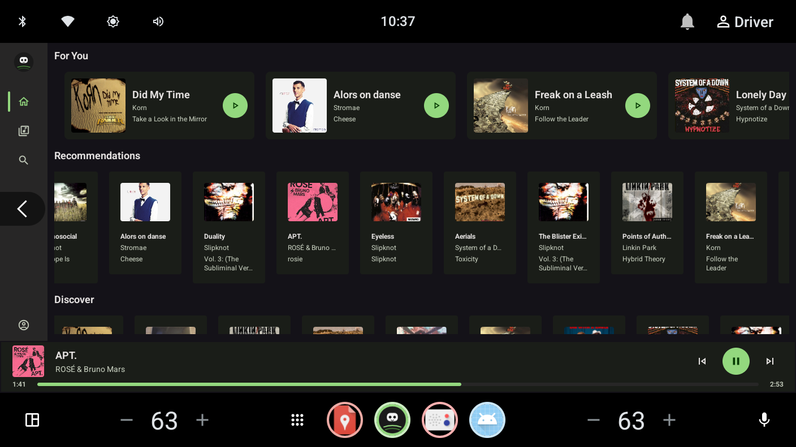
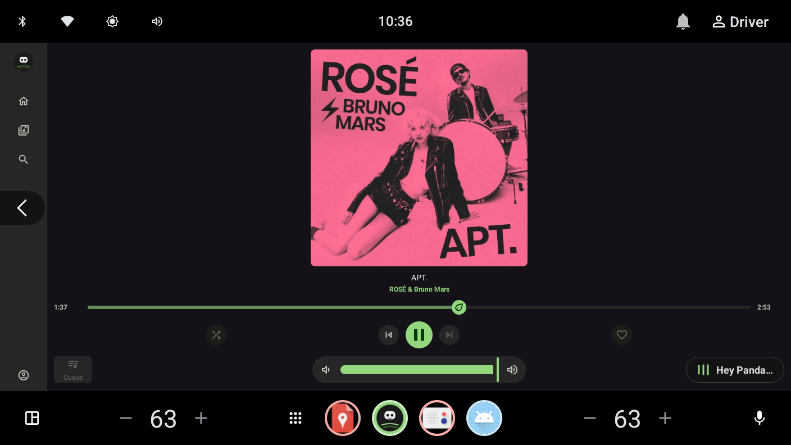
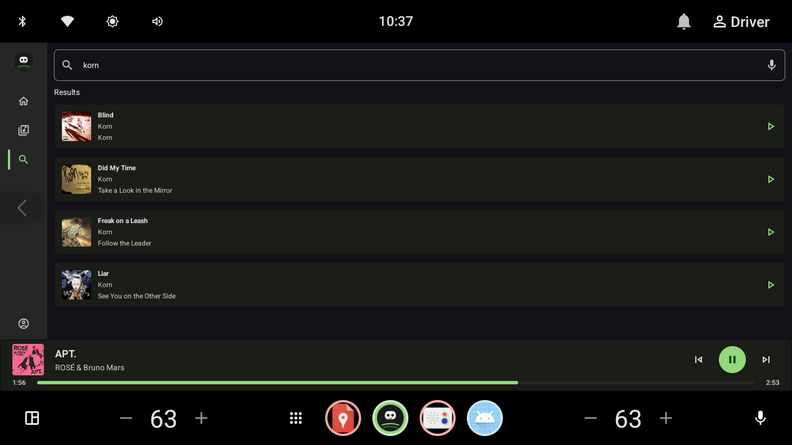
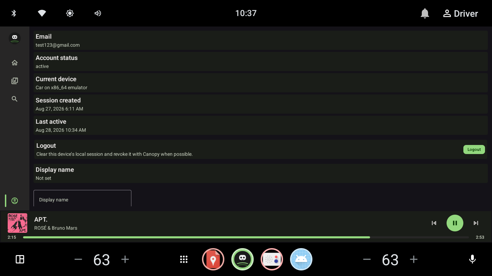
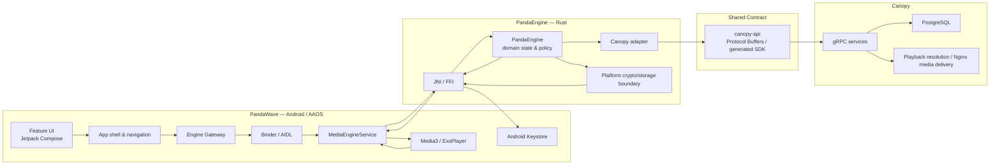
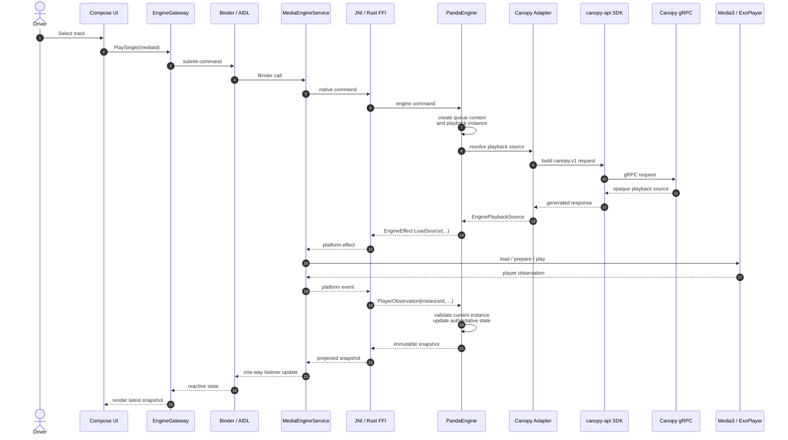
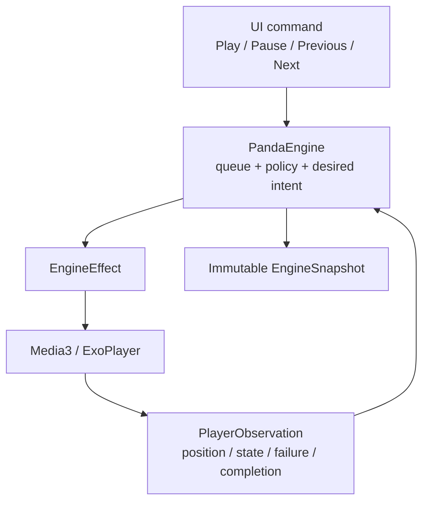
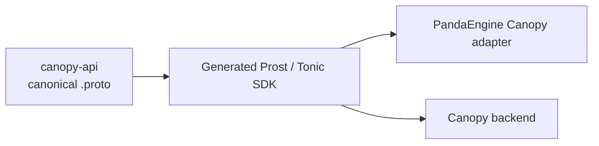

# PandaWave

**PandaWave** is an Android Automotive OS media application built around a Kotlin/Jetpack Compose HMI, Android Media3, and a Rust source-of-truth engine (**PandaEngine**). PandaEngine owns client-side domain decisions and communicates with the **Canopy** backend over gRPC through the shared `canopy-api` contract.

The project focuses on AAOS-native media integration, deterministic state ownership, automotive-safe interaction, secure session handling, and an architecture that keeps backend and domain policy out of the Android UI layer.

> **Status:** active development. The application is developed incrementally so platform integration, architecture changes, and product features remain independently reviewable.

---

## Contents

- [Tech Stack](#tech-stack)
- [What PandaWave Does](#what-pandawave-does)
- [Screenshots](#screenshots)
- [Architecture](#architecture)
- [PandaWave → Canopy Sequence](#pandawave--canopy-sequence)
- [Playback Ownership](#playback-ownership)
- [Key Architectural Decisions](#key-architectural-decisions)
- [Repository Structure](#repository-structure)
- [Related Repositories](#related-repositories)
- [Extended Documentation](#extended-documentation)
- [Development](#development)

---

## Tech Stack

| Area                         | Technology                                                                      |
|------------------------------|---------------------------------------------------------------------------------|
| Platform                     | Android Automotive OS (AAOS)                                                    |
| Android language             | Kotlin                                                                          |
| UI                           | Jetpack Compose                                                                 |
| Media integration            | AndroidX Media3 / ExoPlayer                                                     |
| Android IPC                  | Binder + AIDL                                                                   |
| Native boundary              | JNI + Rust FFI                                                                  |
| Client domain engine         | Rust — PandaEngine                                                              |
| Async/runtime                | Tokio                                                                           |
| Backend transport            | gRPC                                                                            |
| Rust gRPC stack              | Tonic + Prost                                                                   |
| API contract                 | Protocol Buffers via [`canopy-api`](https://github.com/adrianrusu16/canopy-api) |
| Backend                      | [`Canopy`](https://github.com/adrianrusu16/Canopy)                              |
| Backend persistence          | PostgreSQL                                                                      |
| Media delivery               | Nginx-backed streaming                                                          |
| Authentication               | Canopy authentication/session APIs                                              |
| Secure local session storage | Android Keystore-backed encrypted session envelope                              |
| Build                        | Gradle / Android Gradle Plugin + Cargo                                          |
| Testing                      | Rust tests, JVM tests, Android instrumentation/emulator tests                   |
| Performance                  | Macrobenchmark / Perfetto-oriented performance work                             |
| OEM theming                  | Android resources + Runtime Resource Overlays (RRO)                             |

`canopy-api` is currently a private contract repository and requires repository access.

---

## What PandaWave Does

PandaWave is designed as an AAOS-first media HMI rather than a conventional phone music application.

Current product surfaces include:

- media discovery and recommendation surfaces;
- fuzzy-backed catalog search through Canopy;
- full-screen Now Playing;
- persistent mini-player integration;
- Media3 transport/session integration;
- Library surfaces for saved, liked, history, and playlists;
- anonymous browsing and playback;
- authenticated profile/session presentation;
- login, registration, verification, session restoration, and logout flows;
- driver-aware interaction restrictions;
- OEM-customizable design tokens through Android RRO resources.

The Android HMI reacts to state published by PandaEngine instead of reproducing backend/domain rules in Compose.

---

## Screenshots

The screenshots below are captured from the AAOS development environment.

<table>
  <tr>
    <td>
      <strong>Home</strong><br/>
      
    </td>
    <td>
      <strong>Now Playing</strong><br/>
      
    </td>
  </tr>
  <tr>
    <td>
      <strong>Library / History</strong><br/>
      
    </td>
    <td>
      <strong>Search</strong><br/>
      
    </td>
  </tr>
  <tr>
    <td>
      <strong>Authenticated Profile</strong><br/>
      
    </td>
    <td>
      <strong>AAOS system integration</strong><br/>
      
    </td>
  </tr>
</table>

The AAOS launcher, status bar, HVAC controls, and other system surfaces are rendered by the platform. PandaWave supplies its media/session integration and app identity to those system-owned surfaces.

---

## Architecture

PandaWave deliberately separates the Android HMI, Android platform adapters, Rust domain engine, shared API contract, and backend.



### Ownership boundary

| Component                     | Owns                                                                                                                        |
|-------------------------------|-----------------------------------------------------------------------------------------------------------------------------|
| **PandaWave / Compose**       | presentation, navigation, automotive UX, platform rendering                                                                 |
| **MediaEngineService / AIDL** | Android process boundary and engine hosting                                                                                 |
| **JNI / FFI**                 | narrow transport between Kotlin and Rust                                                                                    |
| **PandaEngine**               | client domain state, queue semantics, backend mapping, auth/session coordination, history/library behavior, playback intent |
| **Media3**                    | actual platform player execution and observed playback facts                                                                |
| **Canopy adapter**            | protobuf/gRPC mapping and backend-specific client behavior                                                                  |
| **canopy-api**                | canonical API schema                                                                                                        |
| **Canopy**                    | authentication authority, catalog/user data, authorization, durable persistence, playback-source resolution                 |

---

## PandaWave → Canopy Sequence

The following sequence shows a typical **playback request** traveling from Compose through Binder/AIDL and JNI into PandaEngine, then over gRPC to Canopy. The resolved source returns through PandaEngine as a platform playback effect and is executed by Media3.



### Why this boundary exists

- Compose never knows Canopy RPCs or protobuf types.
- AIDL/JNI carry engine commands, snapshots, results, typed errors, and platform effects — not backend policy.
- PandaEngine owns the meaning of `Previous`, `Next`, queues, history, session state, and backend status mapping.
- The Canopy adapter is the only client component that translates PandaEngine domain data into `canopy.v1`.
- Media3 receives resolved playback information and reports player facts back; it does not become the source of domain truth.

For implementation details, see [Native Engine Host](docs/native-engine-host.md) and [Canopy Backend Integration](docs/canopy-backend-integration.md).

---

## Playback Ownership

Playback intentionally separates **desired intent** from **observed player state**.



PandaEngine owns:

- immutable queue snapshots and the mutable current index;
- transport policy;
- playback-instance identity;
- stale observation rejection;
- source resolution through Canopy;
- bounded source-capability refresh;
- decoder-recovery policy;
- control availability exposed to the HMI.

Media3 owns actual player execution and reports observed facts.

Resolved playback URLs are treated as opaque, short-lived capabilities. They are not reconstructed or persisted by PandaWave.

---

## Key Architectural Decisions

### PandaEngine is the client source of truth

Important product state and backend-facing domain decisions live in Rust. Kotlin observes engine state and performs Android-specific work rather than independently reproducing policy.

### Backend contracts do not cross the HMI boundary

`canopy-api` is the canonical `.proto` contract. Protobuf resources and gRPC status handling stop inside the PandaEngine Canopy adapter.

### AIDL and JNI are transport boundaries

The Android ↔ Rust boundary exposes service-neutral commands, snapshots, typed errors, and effects. Tokens and raw protobuf objects are intentionally kept out of UI/navigation models.

### Authentication is fail-closed

PandaEngine owns the complete authentication/session aggregate. A login or verification flow is not considered complete until the session has been securely committed through the Android Keystore-backed persistence boundary.

### Playback sources are opaque

Canopy resolves the current media identity into a playable source. PandaEngine forwards that resolved source to Media3 and may request one fresh capability when a source is rejected. Neither Kotlin nor Media3 parses or rebuilds signed playback URLs.

### Player observations are instance-scoped

Every load receives an engine-created playback instance ID. Late Media3 observations from superseded loads are ignored, preventing stale completion/failure events from mutating current playback state.

### History remains PandaEngine-owned

Anonymous history is held locally by PandaEngine. Authenticated history is reconciled with Canopy, with history synchronization kept independent of playback success and authentication success.

### Design tokens are resource-driven

PandaWave Compose features consume a centralized design-token model backed by Android resources. Runtime Resource Overlays can customize approved resources without putting OEM-specific styling rules into feature code.

### Performance is treated as an architectural concern

The repository contains benchmark/performance infrastructure and keeps large-list rendering, Binder materialization, caches, Media3 work, and native-engine concurrency as explicit performance concerns rather than relying only on UI-level optimization.

### Concurrency direction

The intended canonical PandaEngine concurrency model is a single-owner Rust actor: one Rust task exclusively owns the mutable engine while slow remote/blocking operations complete asynchronously and return typed completion messages. This migration is kept separate from paging/UI/cache performance work so benchmark changes remain attributable.

See [Architecture Roadmap](docs/architecture-roadmap.md) for the current implementation/migration state.

---

## Repository Structure

```text
Media-App/
├── app/                  # Android application entry point
├── feature/              # Feature modules / Compose destinations
├── core/                 # Shared Android platform, design-system and bridge modules
├── rust/
│   └── engine/           # PandaEngine Rust workspace
├── benchmark/            # Performance / macrobenchmark infrastructure
├── build-logic/          # Gradle convention plugins and architecture/UI checks
├── config/               # Project configuration
└── docs/                 # Extended architecture and development documentation
```

For a deeper module breakdown, see [Module Structure](docs/module-structure.md).

---

## Related Repositories

| Repository                                                              | Purpose                                                                                                                               |
|-------------------------------------------------------------------------|---------------------------------------------------------------------------------------------------------------------------------------|
| [`adrianrusu16/Canopy`](https://github.com/adrianrusu16/Canopy)         | Rust/gRPC backend providing authentication, catalog/user services, durable data, authorization policy, and playback-source resolution |
| [`adrianrusu16/canopy-api`](https://github.com/adrianrusu16/canopy-api) | Canonical Protocol Buffer API contract and generated SDK publication source *(private — access required)*                             |

### Contract flow



The contract repository is versioned independently so PandaEngine and Canopy can pin immutable generated API versions.

---

## Extended Documentation

### Architecture

- [Architecture Roadmap](docs/architecture-roadmap.md)
- [Native Engine Host — AIDL / JNI / Rust](docs/native-engine-host.md)
- [Android Platform Integration](docs/android-platform-integration.md)
- [Module Structure](docs/module-structure.md)
- [AAOS Supported ABIs](docs/aaos-supported-abis.md)

### Canopy

- [Canopy Backend Integration](docs/canopy-backend-integration.md)
- [Local Canopy Integration](docs/canopy-local-integration.md)
- [Canopy SDK Upgrades](docs/canopy-sdk-upgrades.md)

### UI / OEM

- [RRO Design Tokens](docs/rro-design-tokens.md)
- [Assets and Branding](docs/assets-and-branding.md)

### Quality and performance

- [Testing](docs/testing.md)
- [Observability](docs/observability.md)
- [Build Performance](docs/build-performance.md)
- [CI Performance](docs/ci-performance.md)
- [Performance Documentation](docs/performance/)

---

## Development

### Prerequisites

A typical development environment requires:

- Android Studio;
- Android SDK with an Android Automotive OS emulator/image;
- JDK compatible with the project Gradle setup;
- Rust toolchain;
- Android Rust targets/tooling used by the native-engine build;
- access to a compatible Canopy backend for backend-backed flows.

### Build

```bash
./gradlew assembleDebug
```

The repository contains custom Gradle build logic for the Android modules and PandaEngine integration.

### Local backend

For emulator ↔ local-backend setup, use:

- [Canopy Local Integration](docs/canopy-local-integration.md)
- [Canopy Backend Integration](docs/canopy-backend-integration.md)

### Tests

The project separates Rust, local JVM, Android instrumentation, emulator/integration, and performance-oriented testing. See [Testing](docs/testing.md) for the intended test lanes.

---

## Project Principles

PandaWave is developed around a few recurring rules:

1. **Keep the Android HMI reactive.**
2. **Keep client domain ownership in PandaEngine.**
3. **Keep Canopy/protobuf details behind the Rust adapter.**
4. **Treat Media3 as the platform player, not the domain source of truth.**
5. **Fail closed for authentication and session persistence.**
6. **Make race behavior explicit with typed identities/generations.**
7. **Keep automotive restrictions and platform constraints first-class.**
8. **Measure performance on AAOS/HU targets instead of assuming desktop-class resources.**
9. **Keep major architectural migrations independently benchmarkable and reviewable.**
10. **Put detailed design material in `docs/`; keep this README useful as a fast project overview.**
