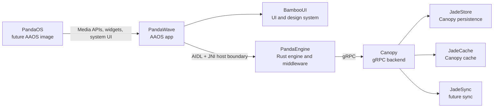
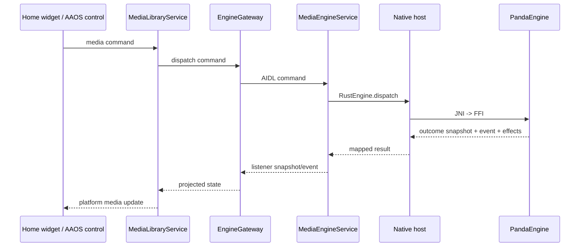

# Android Platform Integration

Android owns PandaWave lifecycle, framework surfaces, Media3 projection,
Android Automotive declarations, content providers, native packaging, and
platform effect execution. PandaEngine remains the source of truth behind the
engine gateway.

## Ecosystem Map



## AAOS Media Declaration

The final app declares itself as an Android Automotive media app with the
`com.android.automotive` descriptor:

```xml
<automotiveApp>
    <uses name="media" />
</automotiveApp>
```

During drive mode, driver-safe browsing should flow through the AAOS media host
and PandaWave's Media3 `MediaLibraryService`. The Compose activity remains
subject to platform UX restrictions.

## Surface Flow



## Media3 Projection

Media3 browse/search requests dispatch typed catalog intents through the shared
playback repository and into engine browse/search commands. Result IDs, titles,
artist/album labels, artwork URIs, and item types are fetched through dedicated
engine query APIs and projected into Media3 items.

Root browsing may fall back to stable Android placeholder categories only when
the engine has no root results yet. Media3 item selection routes the selected
media ID back to PandaEngine through `play_media_by_id`.

## Playback Source And Cache

Playback source acquisition is driven by PandaEngine through the
`AudioSourceClient` trait. Android installs an `AudioSourceResolver` on the
native host via JNI; the current production resolver maps engine track IDs to
the stable PandaWave content-URI contract:

```text
content://com.adrianrusu.mediaapp.audio/audio/{trackId}
```

Canopy/Jade-backed stores should serve those URIs through
`PandaWaveAudioContentProvider` without moving playback-state authority out of
PandaEngine. The app installs a file-backed cache store at startup; cache misses
fail loudly until a real Canopy/Jade download path populates the cache. Cache
population writes to a temporary file and moves completed audio into place, so
Media3 never opens a partially written source.

Backend/network downloading belongs in Rust. Kotlin should stay focused on
Android URI/file-descriptor delivery, framework integration, cache-store
bridging, and telemetry hooks.

## Native Packaging Lane

`:core:rust-bridge` owns native library packaging because it owns the Kotlin
native binding and `System.loadLibrary("panda_engine_ffi")`.

The Gradle native lane builds and syncs `panda_engine_ffi` into generated
`jniLibs`:

```powershell
.\gradlew.bat --no-configuration-cache :core:rust-bridge:syncPandaEngineAndroidJniLibs --console=plain
```

To include the generated native libraries during a normal Android build, enable
the native build property:

```powershell
.\gradlew.bat --no-configuration-cache "-PpandaEngine.buildNative=true" :app:assembleDebug --console=plain
```

Compile the native Android smoke test with:

```powershell
.\gradlew.bat --no-configuration-cache "-PpandaEngine.buildNative=true" :core:rust-bridge:assembleDebugAndroidTest --console=plain
```

Run it on a connected device or emulator with:

```powershell
.\gradlew.bat --no-configuration-cache "-PpandaEngine.buildNative=true" :core:rust-bridge:connectedDebugAndroidTest --console=plain
```

Required local toolchain:

- Android NDK installed in the configured Android SDK, `ANDROID_NDK_HOME`, or
  `ANDROID_NDK_ROOT`.
- Rust Android targets:
  `aarch64-linux-android`, `armv7-linux-androideabi`, `i686-linux-android`,
  and `x86_64-linux-android`.
- Cargo available on `PATH`, or `CARGO` pointing at the cargo executable.

The regular Android build does not silently synthesize native libraries. When
the native lane is enabled and the toolchain is incomplete, Gradle fails with a
hard prerequisite error.
