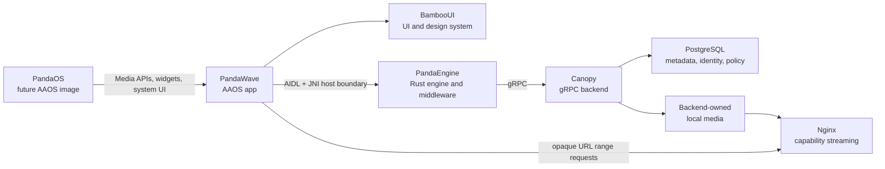
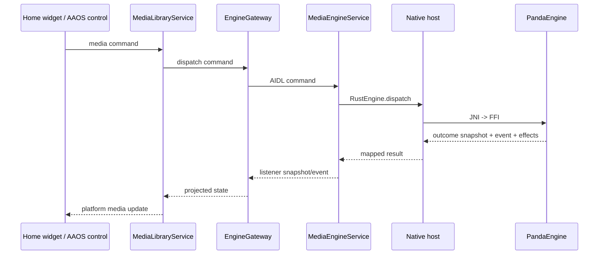

# Android Platform Integration

Android owns PandaWave lifecycle, framework surfaces, Media3 projection,
Android Automotive declarations, content providers, native packaging, and
platform effect execution. PandaEngine remains the source of truth behind the
engine gateway.

## Ecosystem Map



Canopy owns the persistent backend data plane and playback authorization.
PandaWave receives catalog/domain projections and opaque stream capabilities;
it does not connect to PostgreSQL, ingest local media, or reproduce Canopy
authorization policy on-device.

## AAOS Media Declaration

The app declares itself as an Android Automotive media app with the
`com.android.automotive` descriptor:

```xml
<automotiveApp>
    <uses name="media" />
</automotiveApp>
```

During drive mode, driver-safe browsing flows through the AAOS media host
and PandaWave's Media3 `MediaLibraryService`. The Compose activity remains
subject to platform UX restrictions.

## Surface Flow



## Media3 Projection

Media3 browse/search requests dispatch typed catalog intents through the shared
playback repository and into engine browse/search commands. Result IDs, titles,
artist/album labels, artwork URIs, and item types are fetched through dedicated
engine query APIs and projected into Media3 items.

Root browsing may fall back to stable Android placeholder categories only when
the engine has no root results yet. Media3 item selection routes the selected
media ID back to PandaEngine through `play_media_by_id`.

When PandaEngine selects a playable item, it emits a source-preparation effect
before playback. Media3 uses the current Android playback projection to install
the resolved `MediaItem`; metadata update effects remain metadata-only and must
not be treated as implicit source-preparation commands.

## Playback Source And Cache

Online playback source acquisition is driven by PandaEngine's Canopy adapter.
PandaEngine calls `PlaybackService.ResolvePlayback`, preserves the returned
URL, MIME type, and expiry as backend-neutral engine values, and projects them
through JNI/AIDL. Media3 receives the opaque URL verbatim and must not parse,
rebuild, normalize, or exchange its capability token.

The normal online path does not install an Android `AudioSourceResolver` and
does not synthesize `content://` URLs. The existing content-provider/cache
contract is test-only and reserved for an explicitly designed offline cache.
If offline storage is implemented later, cache population and atomic file
publication must remain separate from Canopy's online capability path.

The Android manifest for `:core:rust-bridge` declares `INTERNET` because the
Canopy adapter owns network I/O. Cleartext transport is enabled only in debug
variants for the documented local emulator environment; production deployment
configuration must use TLS/HTTPS and platform-trusted certificates.

## Native Packaging Lane

`:core:rust-bridge` owns native library packaging because it owns the Kotlin
native binding and `System.loadLibrary("panda_engine_ffi")`.

The Gradle native lane builds and syncs `panda_engine_ffi` into generated
`jniLibs`. Normal Android builds depend on this lane by default, so a runnable
APK cannot silently package a stale native engine:

```powershell
.\gradlew.bat --no-configuration-cache :app:assembleDebug --console=plain
```

Build and sync the native libraries directly with:

```powershell
.\gradlew.bat --no-configuration-cache :core:rust-bridge:syncPandaEngineAndroidJniLibs --console=plain
```

Compile the native Android smoke test with:

```powershell
.\gradlew.bat --no-configuration-cache :core:rust-bridge:assembleDebugAndroidTest --console=plain
```

Run it on a connected device or emulator with:

```powershell
.\gradlew.bat --no-configuration-cache :core:rust-bridge:connectedDebugAndroidTest --console=plain
```

Required local toolchain:

- Android NDK installed in the configured Android SDK, `ANDROID_NDK_HOME`, or
  `ANDROID_NDK_ROOT`. The repository pins the supported version through
  `pandaEngine.androidNdkVersion` in `gradle.properties`.
- Rust Android targets:
  `aarch64-linux-android`, `armv7-linux-androideabi`, `i686-linux-android`,
  and `x86_64-linux-android`.
- Cargo available on `PATH`, or `CARGO` pointing at the cargo executable.

When the native toolchain is incomplete, Gradle fails with a hard prerequisite
error. Kotlin-only checks may explicitly opt out with
`-PpandaEngine.buildNative=false`; artifacts produced in that mode are not
runtime-validation artifacts and must not be shipped.
