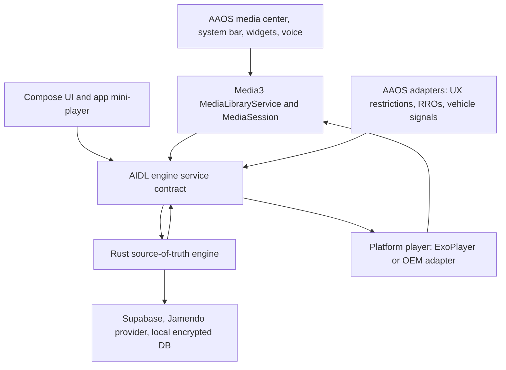

# Architecture Roadmap

This document captures the intended direction for Media App. It should evolve as
the implementation lands, but the core principle is stable: Rust owns the source
of truth, while Android owns the vehicle and platform surfaces.

## Principles

- Rust is the canonical source of truth for app, playback, catalog, user, data,
  and telemetry state.
- AIDL is the primary Android-side boundary to the engine.
- Kotlin owns Android lifecycle, Compose UI, Media3 integration, Hilt wiring,
  Android Keystore access, AAOS UX restrictions, and RRO resource access.
- Media3 and the platform media session are the integration path for AAOS media
  center, system controls, widgets, and the system bar mini-player.
- Automotive safety rules are product requirements, not late validation tasks.
- Security-sensitive logic belongs behind the Rust engine boundary whenever
  possible.

## System Shape



## Planned Modules

| Area | Modules | Responsibility |
| --- | --- | --- |
| App shell | `:app` | Startup, navigation host, top-level Android wiring |
| UI | `:core:designsystem`, `:core:ui`, feature modules | Compose screens, reusable mini-player, theme tokens |
| Automotive | `:core:automotive`, `:core:vehicle`, `:core:carui` | UX restrictions, RRO bridge, vehicle signal abstraction, CarUiLib/OEM hooks |
| Media | `:core:media-adapter` | Media3 service/session and platform playback execution |
| Engine boundary | `:core:rust-bridge` | AIDL client, service binding, DTO mapping |
| Security | `:core:secure-storage-adapter` | Android Keystore bridge for Rust-managed encrypted storage |
| Observability | `:core:telemetry-adapter` | Platform sinks for logs, crashes, traces, and redacted telemetry |
| Rust runtime | `:rust:engine` | Auth, API calls, local DB, playback state, catalog, user, sync, telemetry policy |

## Milestones

| Milestone | Commit Theme | Outcome |
| --- | --- | --- |
| 1 | `chore: add initial AAOS car app template` | Untouched Android Studio Car No Activity baseline |
| 2 | `docs: add AAOS media app architecture roadmap` | Project vision, architecture diagram, milestone plan |
| 3 | `chore: add Gradle version catalog and convention plugins` | Centralized dependency/plugin management |
| 4 | `chore: add modular project structure` | Core and feature modules created with empty contracts |
| 5 | `feat: add AIDL engine service boundary` | Bound service, stable command/snapshot DTO shape, fake engine |
| 6 | `feat: add Rust engine skeleton` | Rust workspace, Android build wiring, smoke test through AIDL adapter |
| 7 | `feat: add secure storage bridge` | Android Keystore-backed key access for Rust-managed encrypted data |
| 8 | `feat: add Media3 playback foundation` | MediaLibraryService, MediaSession, player adapter, system controls |
| 9 | `feat: add automotive UX restriction handling` | Restriction monitor, safe navigation rules, simplified restricted mini-player |
| 10 | `feat: add RRO-ready design tokens` | Overlayable resources and Compose theme bridge |
| 11 | `feat: add Rust-owned data layer` | Supabase, local DB, provider abstraction, fake providers for tests |
| 12 | `feat: add settings and profile flows` | User settings, profile state, privacy controls |
| 13 | `chore: add observability pipeline` | Structured logging, crash reporting, traces, telemetry redaction |
| 14 | `test: add unit and instrumentation coverage` | Kotlin, Rust, Media3, Compose, and automotive adapter tests |
| 15 | `ci: add GitHub Actions workflow` | Lint, unit tests, Rust checks, Dokka, build validation |

## AIDL Boundary

The AIDL service should expose coarse commands and snapshots instead of a chatty
getter API. Kotlin components dispatch events and observe snapshots. Rust
validates commands, updates canonical state, and returns platform work as typed
commands.

Example service shape:

```aidl
interface IMediaEngineService {
    EngineSnapshot getSnapshot();
    void dispatch(in EngineCommand command);
    void registerListener(IEngineListener listener);
    void unregisterListener(IEngineListener listener);
}
```

## App Presentation Pattern

Android UI should follow an MVI shape: Compose renders immutable state, sends
typed intents, and does not call platform, network, database, or Rust APIs
directly. Repositories own state sources, while use cases define the app-facing
operations that ViewModels call.

The first app shell keeps this pattern local to `:app` while feature modules are
still empty. As the implementation grows, feature repositories and use cases can
move behind feature/domain module boundaries without changing the screen model.
Playback-facing UI state is mapped from engine snapshots so the real Rust
engine can replace the fake implementation without changing Compose screens.

## Playback Ownership

Rust drives playback decisions and state. Android executes platform playback and
media-session work because AAOS owns those surfaces.

```text
Media command -> Media3 adapter -> AIDL -> Rust reducer
Rust playback command -> AIDL -> PlatformPlayer -> ExoPlayer/OEM adapter
Player event -> AIDL -> Rust -> canonical playback snapshot
```

The first Android playback foundation is intentionally platform-only: a Media3
`MediaLibraryService` exposes an `ExoPlayer`-backed session to AAOS and media
controllers, while library contents and command policy stay reserved for the
Rust engine wiring milestone.
Media3 play-state changes are projected into engine commands, so system and
AAOS media controls follow the same Rust-owned state path as in-app controls.

## Security Posture

- Never ship Supabase service-role keys or backend-only secrets in the app.
- Treat the Supabase anon/publishable key as public and rely on Row Level
  Security, scoped JWTs, and backend-only privileged operations.
- Keep auth/session, database, and provider logic behind the Rust boundary.
- Store encryption material through Android Keystore and expose only a narrow
  platform key provider to Rust.
- Redact tokens, user identifiers, request bodies, and native errors from logs.
- Use typed errors across AIDL and never expose raw Rust panics to callers.
- Keep the AIDL service non-exported unless an OEM/system integration requires a
  signature-protected exported service.
- Run dependency audit, static analysis, unit tests, and instrumentation tests in
  CI.

## Automotive Integration

- Use Media3 and `MediaSession` as the platform media path.
- Observe AAOS UX restrictions with a platform adapter and project them into
  app and Rust state.
- Use RRO-ready design tokens for OEM customization.
- Prefer public `android.car` APIs for vehicle state.
- Keep HAL/VHAL integrations behind an OEM-only adapter boundary.
- Use CarUiLib and Car UI plugins where available in OEM/system-image builds,
  while preserving a Compose Material fallback for regular distribution.gi
