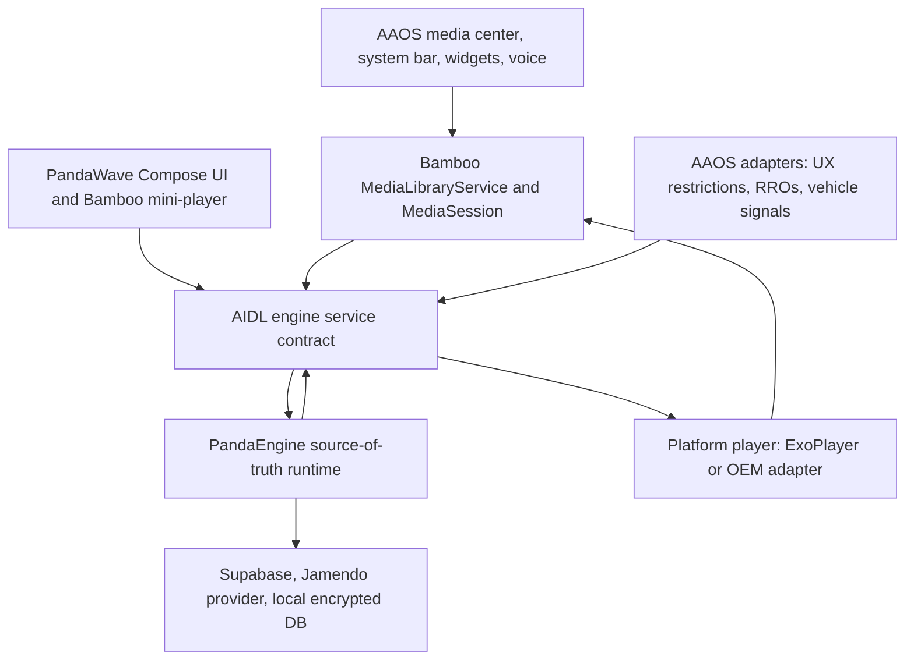

# Architecture Roadmap

This document captures the intended direction for PandaWave. It should evolve as
the implementation lands, but the core principle is stable: Rust owns the source
of truth, while Android owns the vehicle and platform surfaces.

## Principles

- Rust is the canonical source of truth for app, playback, catalog, user, data,
  and telemetry state.
- AIDL is the primary Android-side boundary to the engine.
- Kotlin owns Android lifecycle, Compose UI, Media3 integration, Hilt wiring,
  Android Keystore access, AAOS UX restrictions, and RRO resource access.
- Media3 and the platform media session are the integration path for AAOS media
  center, system controls, widgets, and the system bar mini-player.
- Automotive safety rules are product requirements, not late validation tasks.
- Security-sensitive logic belongs behind the Rust engine boundary whenever
  possible.

## System Shape



The native engine host plan is tracked in
[native-engine-host.md](native-engine-host.md). That document is the source of
truth for the AIDL, JNI, Rust FFI, and PandaEngine hosting boundary.

Android platform integration details are tracked in
[android-platform-integration.md](android-platform-integration.md). That
document owns AAOS declarations, Media3 projection, content-provider/cache
bridges, and the Android native packaging lane.

## Planned Modules

| Area | Modules | Responsibility |
| --- | --- | --- |
| App shell | `:app`, `:feature:appshell` | Startup, navigation host, top-level Android wiring, shell MVI |
| UI | `:core:designsystem`, `:core:ui`, feature modules | Compose screens, reusable mini-player, theme tokens |
| Playback state | `:core:playback` | Shared Bamboo playback projection, command gating, engine/UX observation |
| Automotive | `:core:automotive`, `:core:vehicle`, `:core:carui` | UX restrictions, RRO bridge, vehicle signal abstraction, CarUiLib/OEM hooks |
| Media | `:core:media-adapter` | Media3 service/session and platform playback execution |
| Engine boundary | `:core:rust-bridge` | AIDL client, service binding, DTO mapping |
| Security | `:core:secure-storage-adapter` | Android Keystore bridge for Rust-managed encrypted storage |
| Observability | `:core:telemetry-adapter` | Platform sinks for logs, crashes, traces, and redacted telemetry |
| Rust runtime | `:rust:engine` | Auth, API calls, local DB, playback state, catalog, user, sync, telemetry policy |

## Naming

- PandaWave is the product and user-facing brand.
- PandaEngine is the Rust source-of-truth engine and middleware runtime.
- Canopy is the gRPC backend that PandaEngine talks to.
- BambooUI is the UI and design-system family.
- JadeStore, JadeCache, and JadeSync belong to the Canopy backend ecosystem.
- PandaOS is the future AAOS/AOSP image that can surface PandaWave through
  Android media APIs.
- `RustEngine` remains the Kotlin interface for the Android-to-Rust boundary.
- PandaEngine is the concrete source-of-truth engine implementation, including
  the native binding wrapper and Rust FFI surface.
- Bamboo names user-facing UI surfaces, such as the in-app mini-player,
  controls, and theme/design-system elements. Domain and adapter internals
  should use Panda or neutral media names instead.

## Milestones

| Milestone | Commit Theme | Outcome |
| --- | --- | --- |
| 1 | `chore: add initial AAOS car app template` | Untouched Android Studio Car No Activity baseline |
| 2 | `docs: add AAOS media app architecture roadmap` | Project vision, architecture diagram, milestone plan |
| 3 | `chore: add Gradle version catalog and convention plugins` | Centralized dependency/plugin management |
| 4 | `chore: add modular project structure` | Core and feature modules created with empty contracts |
| 5 | `feat: add AIDL engine service boundary` | Bound service, stable command/snapshot DTO shape, fake engine |
| 6 | `feat: add Rust engine skeleton` | Rust workspace, Android build wiring, smoke test through AIDL adapter |
| 7 | `feat: add secure storage bridge` | Android Keystore-backed key access for Rust-managed encrypted data |
| 8 | `feat: add Media3 playback foundation` | MediaLibraryService, MediaSession, player adapter, system controls |
| 9 | `feat: add automotive UX restriction handling` | Restriction monitor, safe navigation rules, simplified restricted mini-player |
| 10 | `feat: add RRO-ready design tokens` | Overlayable resources and Compose theme bridge |
| 11 | `feat: add Rust-owned data layer` | Supabase, local DB, provider abstraction, fake providers for tests |
| 12 | `feat: add settings and profile flows` | User settings, profile state, privacy controls |
| 13 | `chore: add observability pipeline` | Structured logging, crash reporting, traces, telemetry redaction |
| 14 | `test: add unit and instrumentation coverage` | Kotlin, Rust, Media3, Compose, and automotive adapter tests |
| 15 | `ci: add GitHub Actions workflow` | Lint, unit tests, Rust checks, Dokka, build validation |

## AIDL Boundary

The AIDL service should expose coarse commands and snapshots instead of a chatty
getter API. Kotlin components dispatch events and observe snapshots. Rust
validates commands, updates canonical state, and returns platform work as typed
commands.

Android playback UI depends on `BambooPlaybackRepository`, the shared
Android-side projection of PandaEngine playback state. That repository depends
on `EngineGateway`, the app-facing port for engine commands and snapshots. The
app graph now binds `AidlEngineGateway` through `AndroidEngineServiceConnection`,
while `InProcessEngineGateway` remains useful for fast tests and local
fake-engine scenarios. UI repositories, use cases, and Bamboo Media3 surfaces
stay on the same gateway boundary.
`BambooPlaybackRepository` subscribes to gateway snapshots and engine events so
changes from system media controls, Media3, or future service-side work can
update mini-player and Now Playing state without waiting for a local screen
intent.
Because service binding is asynchronous, the AIDL gateway queues early commands
and replays them once the engine service connects. This keeps startup bootstrap
and first media commands from being lost during process creation.

Example service shape:

```aidl
interface IMediaEngineService {
    EngineSnapshot getSnapshot();
    void dispatch(in EngineCommand command);
    void dispatchPlatformEvent(in EnginePlatformEvent event);
    void registerListener(IEngineListener listener);
    void unregisterListener(IEngineListener listener);
}
```

## App Presentation Pattern

Android UI should follow an MVI shape: Compose renders immutable state, sends
typed intents, and does not call platform, network, database, or Rust APIs
directly. Repositories own state sources, while use cases define the app-facing
operations that ViewModels call.
Hilt owns Android-side dependency graphs, with app-wide engine and telemetry
objects scoped separately from view-model-owned UI state repositories.

The app shell now lives in `:feature:appshell`, with `:app` kept as the Android
composition root for startup, manifest, and app-wide singleton bindings. As the
implementation grows, destination content can move behind feature/domain module
boundaries without changing the screen model.
Home, Library, Search, Settings, and Profile now expose route Composables from
their own modules, while the shell keeps shared chrome, navigation state, and
the in-app mini-player.
Settings is the first destination with its own feature MVI stack, use cases,
ViewModel, repository, and Hilt bindings. Its privacy and personalization
controls observe AAOS UX restrictions and become parked-only when required.
Playback-facing UI state is mapped from the shared `BambooPlaybackRepository` so
PandaEngine can replace the fake implementation without changing Compose
screens.
Now Playing and the app-shell mini-player consume the same Bamboo playback
state. The full Now Playing destination hides the shell mini-player because it
would otherwise duplicate the summary of the active screen.

## Playback Ownership

PandaEngine drives playback decisions and state. Android executes platform playback and
media-session work because AAOS owns those surfaces.

```text
Media command -> Bamboo Media3 adapter -> BambooPlaybackRepository -> AIDL -> PandaEngine reducer
PandaEngine playback command -> AIDL -> PlatformPlayer -> ExoPlayer/OEM adapter
Player event -> AIDL -> PandaEngine -> canonical playback snapshot
```

The first Android playback foundation is intentionally platform-only: a Media3
`MediaLibraryService` exposes an `ExoPlayer`-backed session to AAOS and media
controllers, while library contents and command policy stay reserved for the
Rust engine wiring milestone.
Media3 play-state changes are projected into `BambooPlaybackRepository`, so system and
AAOS media controls share the same command gating and Rust boundary as in-app controls. Bamboo playback snapshots are projected back into Media3 metadata and play readiness so platform surfaces show the same current track as Compose. Media3 controller commands are also gated by engine readiness so AAOS controls stay disabled until PandaEngine is explicitly ready.

## Security Posture

- Never ship Supabase service-role keys or backend-only secrets in the app.
- Treat the Supabase anon/publishable key as public and rely on Row Level
  Security, scoped JWTs, and backend-only privileged operations.
- Keep auth/session, database, and provider logic behind the Rust boundary.
- Store encryption material through Android Keystore and expose only a narrow
  platform key provider to Rust.
- Redact tokens, user identifiers, request bodies, and native errors from logs.
- Route Android logs and diagnostics through the telemetry adapter so redaction
  is applied before events reach sinks.
- Use typed errors across AIDL and never expose raw Rust panics to callers.
- Keep the AIDL service non-exported unless an OEM/system integration requires a
  signature-protected exported service.
- Run dependency audit, static analysis, unit tests, and instrumentation tests in
  CI.

## Automotive Integration

- Use Media3 and `MediaSession` as the platform media path.
- Declare the final app as an Android Automotive media app with the
  `com.android.automotive` descriptor. During drive mode, driver-safe browsing
  should flow through the AAOS media host and the app's Media3
  `MediaLibraryService`; the Compose activity remains subject to platform UX
  restrictions.
- Observe AAOS UX restrictions with a platform adapter and project them into
  app and Rust state.
- Use RRO-ready design tokens for OEM customization.
- Prefer public `android.car` APIs for vehicle state.
- Keep HAL/VHAL integrations behind an OEM-only adapter boundary.
- Use CarUiLib and Car UI plugins where available in OEM/system-image builds,
  while preserving a Compose Material fallback for regular distribution.


