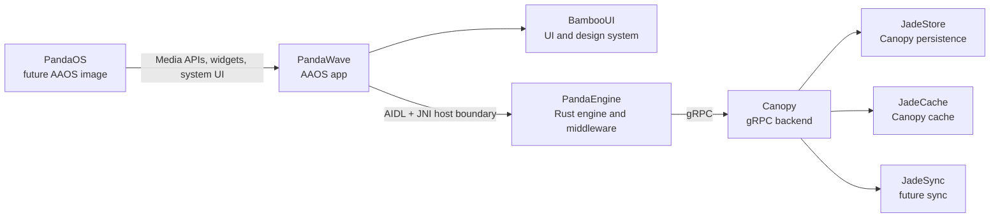
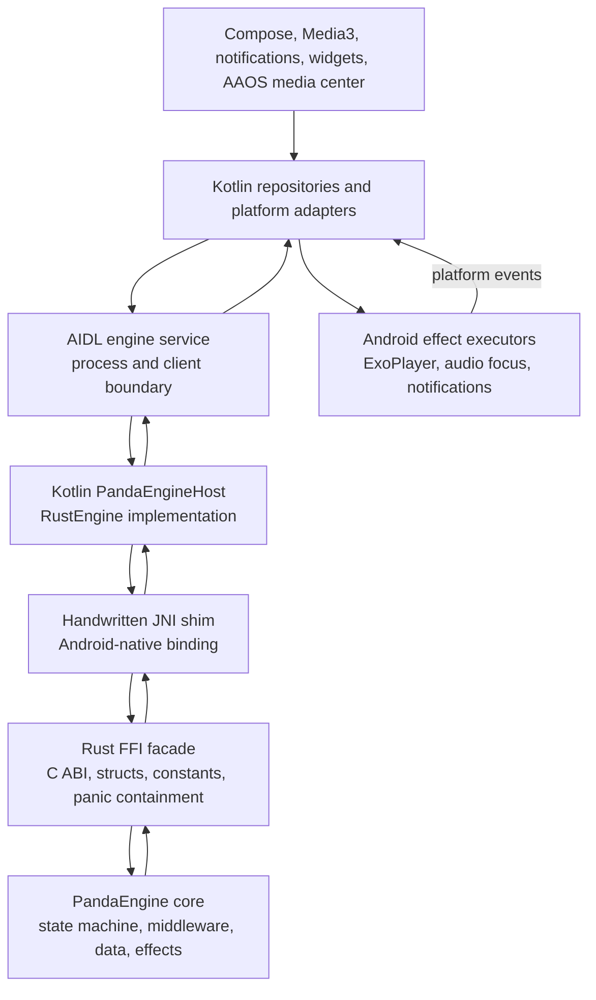
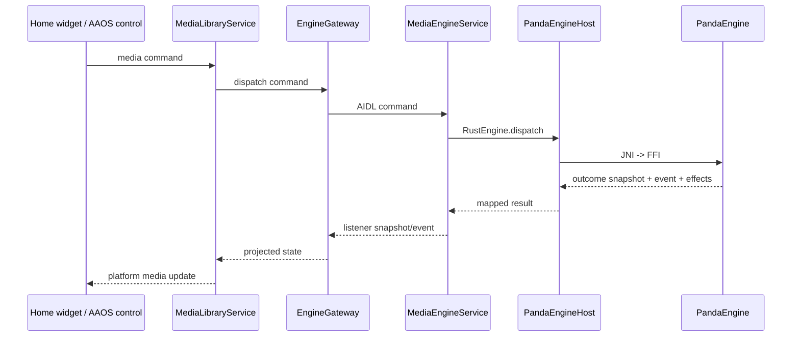

# Native Engine Host

PandaWave treats PandaEngine as a platform-grade runtime, not a helper library.
The Android app owns Android lifecycle and surfaces; Rust owns deterministic
media state and domain decisions.

## Ecosystem Map



## Host Stack



## Boundary Responsibilities

| Boundary | Owns | Must Not Own |
| --- | --- | --- |
| PandaEngine core | Domain state, state machine, middleware, queue, catalog, session, effects | Android lifecycle, JNI, AIDL, UI naming |
| Rust FFI facade | ABI-safe handles, constants, structs, memory rules, panic containment | Domain decisions |
| JNI shim | JVM/native conversion and Android-specific native entrypoints | Business logic |
| Kotlin engine host | Native handle lifecycle, thread dispatch, DTO mapping, hard native-load failures | Rust state transitions |
| AIDL service | Process boundary, listener registration, snapshots, command/event delivery | UI policy |
| Android adapters | Media3, widgets, notifications, audio focus, AAOS restrictions, RROs | Canonical playback/catalog state |

## Service Model

The engine should be hosted by a non-exported Android service boundary and
observed by Media3, Compose, widgets, and future PandaOS surfaces through the
same gateway contract. Android can keep media affordances alive through
`MediaLibraryService`, while the engine service owns one Rust engine instance.



## Integration Milestones

1. **Native Library Packaging**
   Build `panda_engine_ffi` for Android ABIs and package
   `libpanda_engine_ffi.so` through `:core:rust-bridge` generated `jniLibs`.

2. **JNI Shim**
   Add Android-native JNI entrypoints that match `PandaEngine.kt`. The shim
   should call the Rust FFI facade and convert FFI structs into Kotlin-friendly
   primitives or DTOs.

3. **Native Engine Selection**
   Use a native-only production factory. Fake engines are explicit test/local
   fixtures and must not be selected silently by production service code.

4. **Contract Expansion**
   Expand AIDL/Kotlin commands, snapshots, events, and effects to match the
   Rust engine contract intentionally. Do not expose every Rust field by habit;
   expose fields that Android surfaces need.

   Current snapshot projection includes playback state, restriction state,
   update time, active-session/error flags, result counts, playback speed,
   position, busy/dispatch state, voice-hypothesis presence, browse-result
   count, duration, and player-control visibility/enabled/active state.
   String-heavy current media metadata, including album and artwork URI, is
   fetched through dedicated JNI query APIs after the compact snapshot is decoded.
   The Kotlin host caches those queried values per native metadata revision so
   repeated observations, progress ticks, or other numeric state changes do not
   re-cross JNI for unchanged metadata. Result item details should follow the same
   query pattern rather than expanding the compact JNI snapshot indefinitely.

   Playback progress is projected from the latest engine anchor snapshot. The
   engine remains the source of truth for position, duration, playback speed, and
   state transitions; Android surfaces may derive a display position from that
   anchor and the local clock between snapshots. This keeps progress bars smooth
   without making metadata, artwork, or catalog strings dirty on every frame.

   Playback control commands include play/pause/skip plus typed seek, playback
   speed, and play-by-media-id intents. Android maps those typed intents into
   stable AIDL/JNI command names and numeric/string payloads; Rust parses the
   payloads into domain command types at the FFI boundary.

5. **Effect Execution**
   Route engine effects to Android executors, then report platform events back
   into PandaEngine.

   Playback source acquisition is driven by PandaEngine through the
   `AudioSourceClient` trait. Android installs an `AudioSourceResolver` on the
   native host via JNI; the current production resolver maps engine track IDs to
   the stable PandaWave content-URI contract
   `content://com.adrianrusu.mediaapp.audio/audio/{trackId}`. Future
   Canopy/Jade-backed stores should serve those URIs through
   `PandaWaveAudioContentProvider` without moving playback-state authority out
   of PandaEngine. The default content store fails loudly until a real backend
   or local cache is installed.

6. **Engine-Backed Catalog**
   Replace placeholder Media3 browsing/search with engine browse/search
   commands and snapshot/result projection.

   Media3 browse/search requests now dispatch typed catalog intents through the
   shared playback repository and into `TYPE_BROWSE` / `TYPE_SEARCH` engine
   commands. Result IDs, titles, artist/album labels, artwork URIs, and item
   types are fetched through dedicated engine query APIs and projected into
   Media3 items. Root browsing falls back to stable Android placeholder
   categories only when the engine has no root results yet. Media3 item
   selection routes the selected media ID back to PandaEngine through
   `play_media_by_id`.

## Naming Rule

Use **Bamboo** for user-facing UI and design-system components, such as
`BambooMiniPlayer`, theme tokens, controls, and visible UI surfaces.

Use **Panda** or neutral media/domain names for implementation and source of
truth types, such as engine hosts, media catalog nodes, snapshots, repositories,
and adapters that are not visible to the user.

## Native Packaging Lane

`:core:rust-bridge` owns native library packaging because it owns the Kotlin
native binding and `System.loadLibrary("panda_engine_ffi")`.

The Gradle native lane builds and syncs `panda_engine_ffi` into generated
`jniLibs`:

```powershell
.\gradlew.bat --no-configuration-cache :core:rust-bridge:syncPandaEngineAndroidJniLibs --console=plain
```

To include the generated native libraries during a normal Android build, enable
the native build property:

```powershell
.\gradlew.bat --no-configuration-cache "-PpandaEngine.buildNative=true" :app:assembleDebug --console=plain
```

Compile the native Android smoke test with:

```powershell
.\gradlew.bat --no-configuration-cache "-PpandaEngine.buildNative=true" :core:rust-bridge:assembleDebugAndroidTest --console=plain
```

Run it on a connected device or emulator with:

```powershell
.\gradlew.bat --no-configuration-cache "-PpandaEngine.buildNative=true" :core:rust-bridge:connectedDebugAndroidTest --console=plain
```

Required local toolchain:

- Android NDK installed in the configured Android SDK, `ANDROID_NDK_HOME`, or
  `ANDROID_NDK_ROOT`.
- Rust Android targets:
  `aarch64-linux-android`, `armv7-linux-androideabi`, `i686-linux-android`,
  and `x86_64-linux-android`.
- Cargo available on `PATH`, or `CARGO` pointing at the cargo executable.

The regular Android build does not silently synthesize native libraries. When
the native lane is enabled and the toolchain is incomplete, Gradle fails with a
hard prerequisite error.
