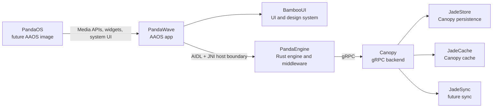
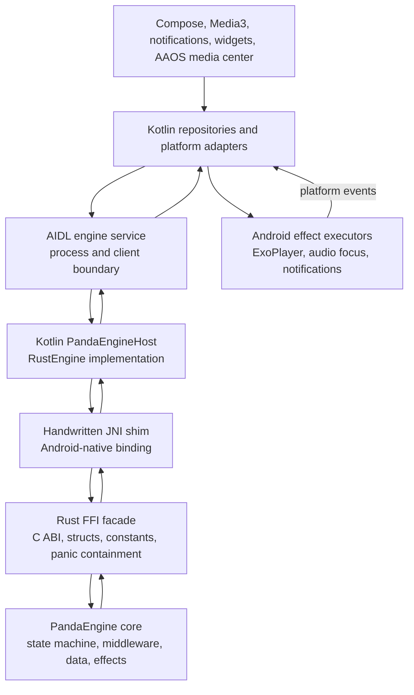
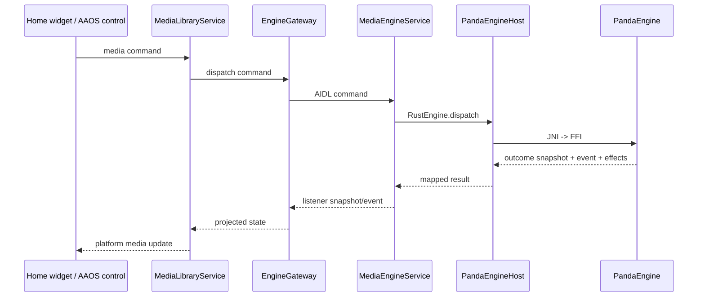

# Native Engine Host

PandaWave treats PandaEngine as a platform-grade runtime, not a helper library.
The Android app owns Android lifecycle and surfaces; Rust owns deterministic
media state and domain decisions.

## Ecosystem Map

## Host Stack

## Boundary Responsibilities

| Boundary | Owns | Must Not Own |
| --- | --- | --- |
| PandaEngine core | Domain state, state machine, middleware, queue, catalog, session, effects | Android lifecycle, JNI, AIDL, UI naming |
| Rust FFI facade | ABI-safe handles, constants, structs, memory rules, panic containment | Domain decisions |
| JNI shim | JVM/native conversion and Android-specific native entrypoints | Business logic |
| Kotlin engine host | Native handle lifecycle, fallback policy, thread dispatch, DTO mapping | Rust state transitions |
| AIDL service | Process boundary, listener registration, snapshots, command/event delivery | UI policy |
| Android adapters | Media3, widgets, notifications, audio focus, AAOS restrictions, RROs | Canonical playback/catalog state |

## Service Model

The engine should be hosted by a non-exported Android service boundary and
observed by Media3, Compose, widgets, and future PandaOS surfaces through the
same gateway contract. Android can keep media affordances alive through
`MediaLibraryService`, while the engine service owns one Rust engine instance.

## Integration Milestones

1. **Native Library Packaging**
   Build `panda_engine_ffi` for Android ABIs and package
   `libpanda_engine_ffi.so` into the app or `:core:rust-bridge`.

2. **JNI Shim**
   Add Android-native JNI entrypoints that match `PandaEngine.kt`. The shim
   should call the Rust FFI facade and convert FFI structs into Kotlin-friendly
   primitives or DTOs.

3. **Native Engine Selection**
   Replace fake-only construction with a native-first factory and explicit fake
   fallback for tests/local failure modes.

4. **Contract Expansion**
   Expand AIDL/Kotlin commands, snapshots, events, and effects to match the
   Rust engine contract intentionally. Do not expose every Rust field by habit;
   expose fields that Android surfaces need.

5. **Effect Execution**
   Route engine effects to Android executors, then report platform events back
   into PandaEngine.

6. **Engine-Backed Catalog**
   Replace placeholder Media3 browsing/search with engine browse/search
   commands and snapshot/result projection.

## Naming Rule

Use **Bamboo** for user-facing UI and design-system components, such as
`BambooMiniPlayer`, theme tokens, controls, and visible UI surfaces.

Use **Panda** or neutral media/domain names for implementation and source of
truth types, such as engine hosts, media catalog nodes, snapshots, repositories,
and adapters that are not visible to the user.
