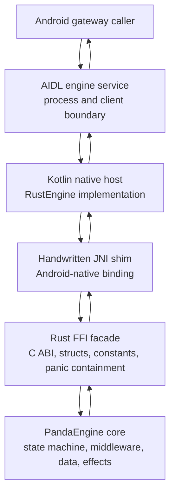
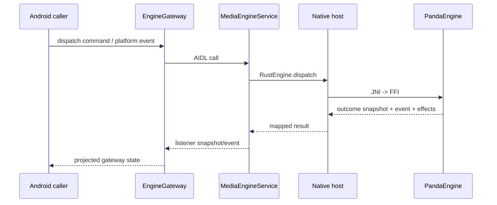

# Native Engine Host

This document describes the boundary that hosts PandaEngine inside the Android
process model. It is intentionally about the engine contract, native binding,
and service boundary. Product surfaces, Android Automotive discoverability,
Media3 projection, content providers, and UI naming live in
[android-platform-integration.md](android-platform-integration.md) and
[architecture-roadmap.md](architecture-roadmap.md).

PandaEngine is a platform-grade runtime, not a helper library. Rust owns
deterministic media state and domain decisions; Android owns lifecycle,
surfaces, framework APIs, and platform execution.

## Host Stack



## Boundary Responsibilities

| Boundary | Owns | Must Not Own |
| --- | --- | --- |
| PandaEngine core | Domain state, state machine, middleware, queue, catalog, session, effect requests | Android lifecycle, JNI, AIDL, UI naming, framework APIs |
| PandaEngine Canopy adapter | `canopy.v1` protobuf/gRPC, generated SDKs, transport, canonical status mapping, pagination, and wire-to-domain projection | Android lifecycle, Media3 types, deployment secrets, backend authorization policy |
| Rust FFI facade | ABI-safe handles, constants, structs, memory rules, panic containment | Domain decisions, Android framework behavior |
| JNI shim | JVM/native conversion and Android-specific native entrypoints | Business logic, state transitions, policy decisions |
| Kotlin native host | Native handle lifecycle, thread dispatch, DTO mapping, hard native-load failures | Rust state transitions, UI or Media3 projection policy |
| AIDL service | Process boundary, listener registration, snapshots, command/event delivery | UI policy, Media3 behavior, content-provider/cache decisions |

Android surface adapters sit outside this host boundary. They may call the
engine gateway and execute returned effect requests, but they do not become part
of PandaEngine.

## Service Model

The engine should be hosted by a non-exported Android service boundary. Android
callers observe the same gateway contract, and the service owns one native
PandaEngine instance through the Kotlin host.



## Integration Milestones

1. **FFI Facade**
   Expose `panda_engine_core` through a compact C ABI with explicit ownership,
   stable discriminants, ABI-safe structs, and panic containment.

2. **JNI Shim**
   Add Android-native JNI entrypoints that match the Kotlin native host. The
   shim should call the Rust FFI facade and convert FFI structs into
   Kotlin-friendly primitives or DTOs.

3. **Native Engine Selection**
   Use a native-only production factory. Fake engines are explicit test/local
   fixtures and must not be selected silently by production service code.

4. **Contract Expansion**
   Expand AIDL/Kotlin commands, snapshots, events, and effects to match the
   Rust engine contract intentionally. Do not expose every Rust field by habit;
   expose fields that callers need through stable host contracts.

   Current snapshot projection includes playback state, restriction state,
   update time, active-session/error flags, result counts, playback speed,
   position, busy/dispatch state, voice-hypothesis presence, browse-result
   count, duration, and player-control visibility/enabled/active state.
   String-heavy current media metadata, including album and artwork URI, is
   fetched through dedicated JNI query APIs after the compact snapshot is
   decoded. The Kotlin host caches those queried values per native metadata
   revision so repeated observations, progress ticks, or other numeric state
   changes do not re-cross JNI for unchanged metadata. Result item details
   should follow the same query pattern rather than expanding the compact JNI
   snapshot indefinitely.

   Playback progress is projected from the latest engine anchor snapshot. The
   engine remains the source of truth for position, duration, playback speed,
   and state transitions; callers may derive a display position from that anchor
   and the local clock between snapshots. This keeps progress smooth without
   making metadata, artwork, or catalog strings dirty on every frame.

   Playback control commands include play/pause/skip plus typed seek, playback
   speed, and play-by-media-id intents. Android maps those typed intents into
   stable AIDL/JNI command names and numeric/string payloads; Rust parses the
   payloads into domain command types at the FFI boundary.

5. **Effect Requests**
   Route engine effect requests to Android executors, then report platform
   events back into PandaEngine. The engine defines what work is needed; Android
   decides how framework-specific work is executed.
   Playback source preparation is a dedicated effect request, separate from
   metadata updates, so host code does not infer data-plane work from display
   metadata changes.

6. **Engine-Backed Catalog Contract**
   Expose browse/search commands and result-query APIs through the engine
   boundary. Android projection into framework media items belongs to the
   platform integration layer.

## Data Planes

The control plane should stay typed, copied, stable, and versioned:

```text
EngineControlPlane = AIDL commands + snapshots + events + compact JNI values
```

High-volume media payloads should use handles, URIs, file descriptors, or
buffer abstractions where appropriate:

```text
EngineDataPlane = content handles + source descriptors + zero-copy eligible buffers
```

PandaEngine should own data-policy decisions and backend communication. Android
should own Android-specific handles and framework delivery mechanisms.

## Canopy Composition

Production composition is explicit and fail-closed. Android supplies the
secret-free, schema-versioned deployment JSON, and PandaEngine validates it
before creating one shared Canopy channel. Catalog, playback, and system
adapters are installed together under the engine lock. A failed first attempt
is terminal for that engine handle; an identical ready configuration is
idempotent, while a conflicting configuration is rejected.

The public Kotlin and C entrypoints default to production transport rules.
Only the Android service's debuggable application flag can select development
rules for the local cleartext emulator deployment. Non-loopback deployments must
use TLS; the Rust channel enables platform roots and may add a deployment
public CA without exposing certificate or server-name details through debug
output.

A single `SessionCoordinator` owns access-token attachment, refresh-token
rotation, and persisted session envelopes. Every Canopy RPC is classified by an
explicit `CanopyOperation` entry that defines retry replay and authentication
requirements. Raw configuration JSON, protobuf messages, gRPC status objects,
bearer tokens, playback capabilities, and pagination cursors do not cross into
Kotlin.
