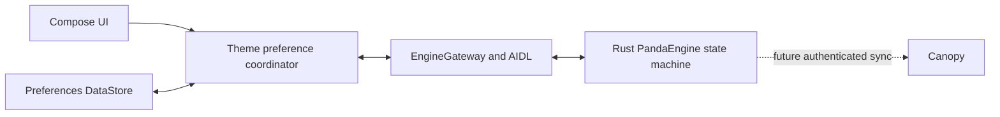

# PW-PRD-002: Persistent Preferences And Rotary UI

**Status:** Approved
**Owners:** Product, Design, Engineering
**Last updated:** 2026-06-20
**Related:** `PW-PRD-001-adaptive-app-shell.md`, `docs/rro-design-tokens.md`, `docs/native-engine-host.md`

## Problem

PandaWave currently keeps the selected theme only in memory, so an app process restart resets the user's choice. Destination content can be scrolled by touch, but focus traversal and scrolling are not consistently connected for DPAD and rotary input. Functional icons use a mixture of filled styles, and several component dimensions remain embedded in Compose code instead of the OEM overlay contract.

## Outcomes

- The most recently applied theme is restored locally before PandaEngine or a backend is available.
- App startup presents a branded platform splash while the first durable theme value is resolved.
- PandaEngine participates in typed, bidirectional preference synchronization without becoming a startup dependency.
- Every actionable control is reachable and visible with DPAD and rotary input.
- Generic functional iconography uses a consistent outlined style.
- Now Playing and the mini-player share the approved panda-paw play treatment.
- OEMs can tune stable component geometry through Runtime Resource Overlays.
- The launcher uses an adaptive PandaWave icon instead of the default Android application icon.

## Non-Goals

- Implementing Canopy networking before a Canopy client and authenticated profile API exist.
- Caching separate themes for guest and authenticated users.
- Persisting sensitive credentials or account tokens in the preferences store.
- Replacing AAOS platform focus or distraction-optimization policy.
- Holding the splash screen until PandaEngine, authentication, media catalog, or Canopy is ready.
- Making internal vector coordinates, animation phases, or transient layout calculations public RRO contracts.

## Architecture

DataStore is the device-local startup authority. PandaEngine receives the cached preference after its service becomes available and may later publish an authenticated profile preference. A valid profile preference for the active session replaces the local cache and updates the UI. Local UI changes are persisted first and then forwarded to PandaEngine for native state projection and future backend synchronization.

The application stores one device-wide theme. Logging out does not clear it. When another user logs in and PandaEngine successfully retrieves that user's preferences, the retrieved theme replaces the cached theme.

## Product Requirements

### Local Persistence

- `PR-PREF-01`: PandaWave shall persist the selected theme with Android Preferences DataStore.
- `PR-PREF-02`: DataStore shall be read before the themed application shell is presented.
- `PR-PREF-03`: Theme restoration shall not depend on PandaEngine service readiness, authentication, Canopy availability, or network connectivity.
- `PR-PREF-04`: The store shall contain one device-wide theme preference rather than per-user theme records.
- `PR-PREF-05`: Logging out shall retain the most recently applied theme.
- `PR-PREF-06`: Unknown or corrupt stored theme values shall resolve to `SystemDefault`, shall not crash startup, and shall emit diagnostic telemetry.
- `PR-PREF-07`: Settings and app theme presentation shall observe the same repository flow. Settings shall not copy the repository's initial value into an independent mutable theme state.

### Startup Experience

- `PR-START-01`: PandaWave shall use the native Android SplashScreen API rather than a custom splash activity or Compose-only launch screen.
- `PR-START-02`: The splash shall use an approved PandaWave logo animation with restrained motion appropriate for an automotive display.
- `PR-START-03`: The splash may remain visible while the first DataStore theme value is unresolved.
- `PR-START-04`: PandaEngine creation and service connection shall begin concurrently but shall not gate splash dismissal.
- `PR-START-05`: Authentication, catalog loading, media restoration, network connectivity, and Canopy synchronization shall not gate splash dismissal.
- `PR-START-06`: Startup shall fail open to `SystemDefault` after a bounded timeout or recoverable DataStore failure rather than leave the splash visible indefinitely.
- `PR-START-07`: Splash dismissal shall transition directly into the resolved PandaWave theme without briefly rendering the shell in a known incorrect theme.
- `PR-START-08`: Animation duration shall not artificially delay startup after theme readiness.

### PandaEngine Synchronization

- `PR-ENG-PREF-01`: The Android control plane shall expose typed commands for hydrating PandaEngine from the local cache and for applying an explicit local user selection.
- `PR-ENG-PREF-02`: PandaEngine shall expose typed preference state through its snapshot contract, including theme identifier, initialization state, source, and revision.
- `PR-ENG-PREF-03`: Preference commands and state shall cross the Rust core, C ABI, JNI host, Kotlin native adapter, AIDL service, and `EngineGateway` without ad hoc UI-only payload parsing.
- `PR-ENG-PREF-04`: Reapplying an identical preference shall be a reducer no-op and shall not create a DataStore-to-engine feedback loop.
- `PR-ENG-PREF-05`: A valid authenticated profile preference for the active user session shall update PandaEngine, DataStore, and the running UI.
- `PR-ENG-PREF-06`: A profile preference returned for a stale or inactive user session shall be rejected.
- `PR-ENG-PREF-07`: A local selection made after a profile synchronization request begins shall not be overwritten by a stale response from that request.
- `PR-ENG-PREF-08`: Engine or backend unavailability shall not roll back a successfully persisted local selection.
- `PR-ENG-PREF-09`: Invalid remote theme identifiers shall be ignored and recorded through telemetry rather than written to DataStore.
- `PR-ENG-PREF-10`: Production dependency injection shall always use the real DataStore and native engine implementations. Test doubles shall remain test-only.

### DPAD And Rotary Navigation

- `PR-FOCUS-01`: Every actionable element on Home, Library, Search, Now Playing, Profile, and Settings shall be reachable without touch.
- `PR-FOCUS-02`: Rotary movement shall advance focus one actionable element per resolved input step and automatically bring the focused element fully into view.
- `PR-FOCUS-03`: DPAD up and down shall traverse vertical content. DPAD left and right shall traverse horizontal collections or adjust an already focused adjustable control.
- `PR-FOCUS-04`: Disabled and decorative elements shall be excluded from focus traversal.
- `PR-FOCUS-05`: Horizontal collections shall be focus groups with predictable entry, item traversal, and exit behavior.
- `PR-FOCUS-06`: The shell focus order shall move predictably among the navigation rail, destination content, and mini-player.
- `PR-FOCUS-07`: Returning to a destination should restore its last valid focused element. If that element no longer exists, focus shall move to the first available action.
- `PR-FOCUS-08`: Focus movement shall not resize, reflow, or otherwise shift stable layout geometry.
- `PR-FOCUS-09`: A page with no focusable actions shall permit rotary scrolling of its content rather than trapping input.
- `PR-FOCUS-10`: Custom cards, rows, media tiles, rail items, mini-player controls, and transport controls shall expose a visible theme-aware focus state.

## UI/UX Requirements

### Iconography

- `UX-ICON-01`: Generic functional icons shall use outlined glyphs by default.
- `UX-ICON-02`: Rail destinations, discovery actions, search, profile, settings, and quick actions shall use the centralized outlined icon set.
- `UX-ICON-03`: Filled symbols may be used only when fill communicates an explicit state or approved brand treatment.
- `UX-ICON-04`: The panda-paw play symbol, pause bars, and selected-state symbols are approved exceptions to the outlined default.
- `UX-ICON-05`: Icon selection shall be centralized in the design system rather than repeated independently in feature routes.

### Shared Playback Control

- `UX-PLAY-01`: Now Playing and the mini-player shall use the same branded playback-control component.
- `UX-PLAY-02`: The play state shall display the approved panda-paw silhouette.
- `UX-PLAY-03`: The pause state shall display a conventional two-bar pause symbol.
- `UX-PLAY-04`: Each placement may use a different RRO-controlled size while preserving the same state, focus, disabled, pressed, and accessibility behavior.

### Launcher And Splash Branding

- `UX-BRAND-01`: The launcher icon shall use the PandaWave logo instead of the generated Android placeholder artwork.
- `UX-BRAND-02`: The launcher icon shall be an adaptive icon with foreground, background, round-mask compatibility, and a dedicated monochrome layer.
- `UX-BRAND-03`: Logo artwork shall remain legible within Android adaptive-icon safe zones and common AAOS launcher masks.
- `UX-BRAND-04`: The splash animation and launcher icon shall derive from the same approved PandaWave brand geometry.
- `UX-BRAND-05`: The splash animation shall use a short, calm motion such as the bamboo-wave lines resolving beneath the panda mark. It shall not flash, spin continuously, or imply engine progress.

### Focus Presentation

- `UX-FOCUS-01`: Focus indication shall have sufficient contrast in every PandaWave light and dark theme.
- `UX-FOCUS-02`: Focus indication shall be distinct from selected, playing, disabled, and pressed states.
- `UX-FOCUS-03`: Bringing an element into view shall use the minimum scroll movement needed to reveal its complete focus treatment.
- `UX-FOCUS-04`: Rotary focus movement shall not accidentally change seek or volume values. Adjustable controls shall use DPAD left and right for value changes.

## RRO Contract

The following stable component geometry shall be represented by typed Android resources, published in `public.xml`, allowed in `overlayable.xml`, loaded through the PandaWave design-token provider, and mirrored by the reference RRO:

- Small, medium, and large functional icon sizes.
- Rail width, logo size, item height, item spacing, selected-line width, selected-line height, and selected-line inset.
- Focus-outline width and focus padding.
- Compact and standard media-tile width and height.
- Media-row artwork size and minimum row height.
- Card padding and minimum actionable-card height.
- Mini-player height, artwork size, transport-button size, and internal spacing.
- Progress-track height, progress-thumb size, and volume-control height.
- Now Playing artwork bounds, primary and secondary transport sizes, transport spacing, footer height, and quick-action size.
- Splash background color and supported splash animation duration.

Branded drawable resources, including the splash mark and adaptive-icon layers, shall remain public and overlayable where Android resource-overlay behavior supports them. Material functional glyph geometry remains centralized Kotlin implementation detail, while its rendered dimensions are public RRO resources.

## State And Conflict Rules

1. Startup waits for the first DataStore preference result before presenting the themed shell.
2. The cached theme is applied locally and sent to PandaEngine as hydration when the engine becomes available.
3. A local user selection is written to DataStore, observed by the UI, and sent to PandaEngine.
4. PandaEngine treats identical values as no-ops.
5. A successful authenticated profile synchronization for the active session may replace the cached value.
6. A stale session response or a response older than a later local selection is ignored.
7. The accepted engine value is written to DataStore, and DataStore remains the value used on the next process start.

## Failure Handling

- DataStore read corruption resolves to `SystemDefault` through a corruption handler and telemetry event.
- DataStore write failure leaves the last durable preference active, reports telemetry, and does not claim synchronization success.
- Startup uses a bounded fail-open path if the first DataStore read cannot complete normally.
- Engine connection failure leaves DataStore and UI operation intact; hydration is retried when a service connection is available.
- Canopy timeout, authentication failure, or malformed preference data leaves the local value intact.
- Preference synchronization errors shall not block media playback or application navigation.

## Verification

- Repository tests shall use a temporary DataStore file and prove persistence across repository recreation.
- Coordinator tests shall prove local-first startup, local-to-engine forwarding, remote-to-DataStore application, duplicate suppression, stale-session rejection, and stale-response rejection.
- Rust tests shall cover preference models, reducer transitions, source/revision behavior, command wire mappings, compact snapshot layout, C ABI queries, and JNI projections.
- AIDL parcel tests shall verify preference fields survive a round trip.
- Compose UI tests shall verify DPAD focus order, center-button activation, horizontal focus groups, disabled-item skipping, focus restoration, and bring-into-view.
- Rotary mapping tests shall verify direction, input accumulation, one-step traversal, and no accidental slider adjustment.
- Resource-contract tests shall fail when an approved public dimension is absent from `overlayable.xml` or the reference RRO.
- Startup tests shall verify that DataStore readiness dismisses the splash, engine unavailability does not retain it, and timeout/corruption paths reach `SystemDefault`.
- Resource tests shall verify adaptive launcher foreground, background, round, and monochrome layers and the configured animated splash drawable.
- Emulator QA shall traverse every route at `1408x792` and `160 dpi` with DPAD and rotary input and shall confirm that focused controls remain fully visible.
- Emulator screenshots shall verify outlined rail icons, rounded selection lines, focus presentation, and matching panda-paw play controls in Now Playing and the mini-player.

## Delivery Milestones

1. Add the DataStore preference repository, branded startup experience, adaptive launcher icon, and complete PandaEngine synchronization contract.
2. Add shared DPAD/rotary focus infrastructure and migrate every route and shared interactive component.
3. Centralize outlined iconography, share the branded playback control, and complete the RRO geometry contract.

Each milestone shall be independently tested, committed, and pushed.

## Acceptance Criteria

- [ ] A selected theme survives app process death and device/app restart.
- [ ] The themed shell uses the DataStore value before PandaEngine is ready.
- [ ] The native splash remains only until theme resolution and cannot be held by engine or network readiness.
- [ ] DataStore failure or timeout dismisses the splash into `SystemDefault` without an indefinite startup block.
- [ ] Local theme changes remain available when PandaEngine or the network is unavailable.
- [ ] An accepted active-user profile preference updates the running UI and the next-start DataStore value.
- [ ] A stale account or stale synchronization response cannot replace a newer local selection.
- [ ] Settings observes repository state without maintaining a second mutable theme source of truth.
- [ ] Every actionable control on every route is reachable and activatable through DPAD.
- [ ] Rotary movement advances focus item-by-item and keeps the focused control fully visible.
- [ ] Disabled controls are skipped and adjustable controls are not changed accidentally by rotary movement.
- [ ] Generic functional icons use outlined glyphs throughout the app.
- [ ] Now Playing and mini-player play states both use the panda-paw symbol and pause states use two bars.
- [ ] The launcher displays the PandaWave adaptive icon, including correct round and monochrome behavior.
- [ ] Approved component dimensions are public, overlayable, typed, and present in the reference RRO.
- [ ] Full Gradle, Rust, resource-contract, Compose UI, and emulator QA checks pass.

## Dependencies

- Android Preferences DataStore.
- Existing `ThemePreferenceRepository`, app theme projection, and Settings feature.
- Existing PandaEngine command, snapshot, C ABI, JNI, AIDL, and `EngineGateway` control plane.
- Existing Compose app shell, shared UI components, design tokens, and reference RRO.
- A future Canopy authenticated profile-preference contract for live backend synchronization.
