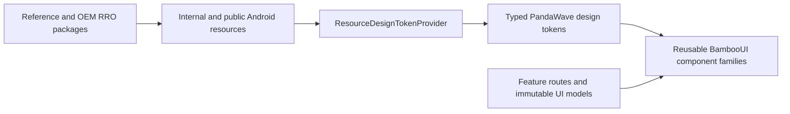

# PW-PRD-003: RRO-Backed BambooUI System

**Status:** In verification
**Owners:** Product, Design, Engineering
**Last updated:** 2026-06-21
**Related:** `PW-PRD-001-adaptive-app-shell.md`,
`PW-PRD-002-persistent-preferences-and-rotary-ui.md`,
`docs/rro-design-tokens.md`

## Problem

PandaWave currently mixes resource-backed design tokens with Compose literals,
feature-owned styling, hardcoded user-facing text, and screen-specific versions
of visually equivalent controls. The public Runtime Resource Overlay contract
still uses the legacy `mediaapp_*` prefix. This makes OEM customization
incomplete, localization difficult, visual consistency fragile, and future
rebranding unnecessarily expensive.

## Outcomes

- Every stable visual choice is represented by a typed Android resource and a
  semantic BambooUI token.
- Every public overlay resource uses its final `pandawave_*` name.
- The reference RRO mirrors and demonstrably overrides the complete public
  token contract.
- Screens compose reusable, accessible BambooUI component families instead of
  owning duplicate card, tile, rail, preference, and playback implementations.
- All user-visible and accessibility text is stored in internal Android string
  resources ready for localization.
- Automated checks prevent hardcoded UI values and incomplete overlay contracts
  from returning.
- The approved Stitch experience remains recognizable while becoming adaptive
  and OEM-tunable.

## Non-Goals

- Renaming the Kotlin package, Gradle namespace, application ID, or every
  non-resource `mediaapp` identifier. Those changes belong to the subsequent
  PandaWave identity migration.
- Exposing product copy, accessibility text, or safety-critical wording to OEM
  overlays.
- Allowing an RRO to replace component behavior, navigation, domain state, or
  Compose layout code.
- Publishing transient drawing calculations, vector coordinates, animation
  phases, mathematical constants, or implementation-only measurements as
  stable OEM APIs.
- Replacing runtime user-selectable themes with overlay APKs.
- Redesigning the approved Stitch screens during the migration.

## Architecture

`:core:designsystem` owns visual primitives, semantic token models, resource
loading, theme projection, icons, and the public overlay contract. `:core:ui`
owns reusable BambooUI components and their interaction, accessibility, focus,
loading, empty, error, disabled, and adaptive states. Feature modules own screen
content, immutable UI models, business intent callbacks, and screen-specific
internal strings. Features shall not restyle shared widgets.

Android resources are the source of truth for stable visual values. Compose
reads them through typed token models rather than loading resource IDs directly
throughout the UI. Resource names, token properties, overlay declarations, and
reference-overlay entries form one versioned contract verified in CI.

## Public RRO Contract

### Naming

- `PR-RRO-01`: Every public overlay resource shall use a `pandawave_*` name.
- `PR-RRO-02`: No new `mediaapp_*` resource shall be published.
- `PR-RRO-03`: Existing public `mediaapp_*` resources shall be replaced in this
  sweep rather than retained as compatibility aliases.
- `PR-RRO-04`: The overlay target name shall remain a stable PandaWave-branded
  API name independent of an individual theme.

### Token Coverage

- `PR-RRO-05`: Stable semantic colors shall be overlayable for every supported
  PandaWave light and dark theme.
- `PR-RRO-06`: Stateful controls shall expose complete normal, focused,
  pressed, selected, checked, and disabled color roles where those states
  apply.
- `PR-RRO-07`: Spacing, shape, elevation, opacity, typography metrics, motion,
  touch targets, icon sizes, layout thresholds, component geometry, and
  restriction limits shall be resource-backed and typed.
- `PR-RRO-08`: Overlayable branded drawables and font-family aliases may be
  public only when they are stable, legally redistributable customization
  points.
- `PR-RRO-09`: Safety behavior, restriction policy meaning, and
  safety-critical wording shall not be overlayable.
- `PR-RRO-10`: Every public resource shall appear with the same type in
  `public.xml`, `overlayable.xml`, the typed provider contract, and the
  reference RRO where an override is demonstrated.
- `PR-RRO-11`: The RRO contract shall customize visual presentation and stable
  geometry without changing component semantics or application behavior.

### Token Families

The typed token model shall organize resources by semantic responsibility:

- Theme and state colors.
- Typography roles and font-family aliases.
- Spacing and content insets.
- Shape and border treatment.
- Elevation and surface treatment.
- Motion durations and easing selections.
- Focus and input treatment.
- General sizing and touch targets.
- App-shell and adaptive layout thresholds.
- Navigation, media, preference, playback, progress, volume, artwork, and
  status-component geometry.
- Automotive restriction limits.

## Internal Text And Localization

- `PR-L10N-01`: All user-visible text shall use Android `string` or `plurals`
  resources rather than Kotlin literals.
- `PR-L10N-02`: All accessibility descriptions, state announcements, error
  messages, and action labels shall use Android resources.
- `PR-L10N-03`: Product and accessibility strings shall remain internal and
  shall not appear in `public.xml` or `overlayable.xml`.
- `PR-L10N-04`: Shared-widget strings shall live with the shared widget owner;
  feature-specific copy shall live in the owning feature module.
- `PR-L10N-05`: Resource names shall follow a stable semantic naming scheme and
  avoid screen-position or temporary-design wording.
- `PR-L10N-06`: Dynamic text shall use format arguments or plurals instead of
  concatenated localized fragments.
- `PR-L10N-07`: Layouts shall tolerate longer translations and Android font
  scaling without clipping, overlap, or inaccessible controls.

## BambooUI Component System

### Component Families

- `UI-BAMBOO-01`: App navigation shall use shared `BambooNavigationRail` and
  `BambooNavigationItem` components.
- `UI-BAMBOO-02`: Home, Library, and Search media collections shall use shared
  media-section, carousel, tile, row, artwork, and section-header components.
- `UI-BAMBOO-03`: Home "For You" and Library "Panda Picks" shall use the same
  media-section and media-tile implementation with different immutable data.
- `UI-BAMBOO-04`: Profile and Settings shall use a shared preference-list
  family with action, toggle, choice, and disclosure variants.
- `UI-BAMBOO-05`: Now Playing and the mini-player shall use shared transport,
  branded play/pause, progress, and volume-control primitives.
- `UI-BAMBOO-06`: Shared buttons, icon controls, artwork surfaces, status
  presentation, section headers, focus treatment, and loading, empty, error,
  unavailable, and disabled states shall not be reimplemented by features.

### Component Boundaries

- `UI-BAMBOO-07`: Components shall expose constrained semantic variants and
  purposeful content slots instead of one universal component with unrelated
  Boolean flags.
- `UI-BAMBOO-08`: Components shall consume typed tokens and immutable UI data,
  emit callbacks, and contain no domain, repository, engine, or navigation
  policy.
- `UI-BAMBOO-09`: Feature routes shall map feature state into shared component
  models and route emitted callbacks back into typed intents.
- `UI-BAMBOO-10`: Component variants shall share dimensions, focus behavior,
  semantics, and state colors unless an explicit tokenized variant requires a
  difference.
- `UI-BAMBOO-11`: Disabled and decorative content shall be excluded from focus
  traversal while retaining correct accessibility semantics.
- `UI-BAMBOO-12`: Stable component bounds shall not shift when focus, press,
  selection, loading, metadata, or playback state changes.

## Adaptive And Automotive Requirements

- `ADAPT-RRO-01`: The preferred reference layout shall remain
  `1408x792` at `160 dpi`.
- `ADAPT-RRO-02`: Components shall also remain usable on compact and larger
  AAOS displays through constraint-driven variants and tokenized thresholds.
- `ADAPT-RRO-03`: RRO-adjusted dimensions shall not create overlapping,
  clipped, unreachable, or off-screen actionable controls.
- `ADAPT-RRO-04`: DPAD, rotary, touch, accessibility, and Media3 behavior shall
  remain equivalent after an overlay is applied.
- `ADAPT-RRO-05`: Driver restrictions shall continue to apply to behavior and
  content depth rather than removing normal transport controls.
- `ADAPT-RRO-06`: Text shall wrap or adapt within stable component constraints;
  font size shall not scale directly from viewport width.

## Quality Enforcement

- `QA-RRO-01`: CI shall fail when production Compose code introduces raw
  colors, `.dp`, `.sp`, corner sizes, elevation, opacity, motion duration, or
  stable component geometry outside approved design-system internals.
- `QA-RRO-02`: Tests, previews, invariant mathematical operations, and
  implementation-only drawing calculations may use narrowly documented
  exceptions that do not represent stable visual choices.
- `QA-RRO-03`: CI shall fail when public, overlayable, provider, or reference
  overlay resource sets drift or disagree on type.
- `QA-RRO-04`: CI shall fail when a production user-visible or accessibility
  string literal is introduced outside Android resources.
- `QA-RRO-05`: CI shall reject legacy `mediaapp_*` resource names after the
  migration.
- `QA-RRO-06`: Resource-contract tests shall validate required color states,
  positive dimensions, valid restriction ranges, and supported typography
  values.
- `QA-RRO-07`: The reference overlay APK shall build in the normal validation
  lane and install against the application package configured for the current
  migration stage. The subsequent identity migration shall update that target
  without renaming the public token resources.

## Failure Handling

- Missing base resources are compile-time failures.
- Missing or stale reference-overlay entries are test failures.
- An incompatible overlay shall fail installation or contract verification
  rather than silently changing application behavior.
- Components shall provide explicit loading, empty, error, unavailable, and
  disabled presentations where their data or action can be unavailable.
- Unsupported media artwork, long metadata, missing subtitles, and unknown
  durations shall preserve stable layout and accessible fallback content.
- A localization formatting failure shall not expose raw format tokens or crash
  a driving surface.

## Verification

- Unit tests shall verify resource parsing, typed token projection, semantic
  state-list completeness, and adaptive variant selection.
- Resource-contract tests shall compare `public.xml`, `overlayable.xml`, the
  provider model, base resources, and the reference RRO.
- Static checks shall scan production Kotlin and XML for forbidden visual and
  text literals and legacy resource names.
- Compose tests shall exercise every shared component family across loading,
  empty, populated, selected, focused, pressed, disabled, unavailable, and
  error states as applicable.
- Accessibility tests shall verify roles, descriptions, state announcements,
  traversal order, and minimum touch targets.
- Pseudo-locale and large-font tests shall verify wrapping, truncation, and
  stable actionable bounds.
- Emulator QA shall compare base and reference-overlay screenshots at the
  preferred display plus compact and larger AAOS configurations.
- Emulator QA shall traverse every route with DPAD and rotary input before and
  after enabling the reference overlay.
- Existing playback, Media3, engine, preference, and automotive tests shall
  remain green.

## Delivery

This requirement is delivered as one coordinated app-wide sweep. Intermediate
work may use local checkpoints, but the milestone is complete only when the
final token contract, shared components, all feature migrations, reference RRO,
enforcement checks, documentation, tests, and emulator QA land together.

## Acceptance Criteria

- [x] Every stable production UI value is resource-backed and represented by a
  typed semantic token.
- [x] Every public resource uses a final `pandawave_*` name.
- [x] No public compatibility aliases retain the `mediaapp_*` resource prefix.
- [x] Every public token is type-consistent across the base app and reference
  overlay contract.
- [x] All user-visible and accessibility text is an internal Android resource.
- [x] Home and Library reuse the same media section and tile implementations.
- [x] Profile and Settings reuse the same preference component family.
- [ ] Now Playing and the mini-player reuse the same playback-control
  primitives.
- [ ] Every shared component supports its applicable loading, empty, error,
  focused, pressed, selected, disabled, and unavailable states.
- [ ] No screen-specific duplicate remains for a component covered by a
  BambooUI family.
- [x] CI rejects new hardcoded production UI values, text literals, and legacy
  resource names.
- [x] The reference RRO builds, installs, and visibly overrides every supported
  token family.
- [ ] Base and overlaid UI pass accessibility, DPAD, rotary, pseudo-locale,
  large-font, adaptive-layout, and screenshot verification.
- [x] Full Android and Rust verification remains green.

## Dependencies

- Existing `:core:designsystem`, `:core:ui`, and feature modules.
- Existing runtime PandaWave theme selection and DataStore preference flow.
- Existing RRO sample module and Android overlayable-resource support.
- Existing adaptive app shell, focus infrastructure, and Stitch design
  reference.
- The subsequent package/application-ID rebrand, which will consume the final
  `pandawave_*` resource contract established here.
