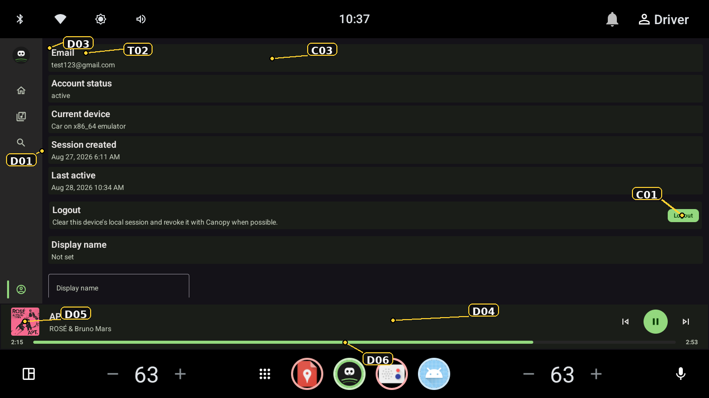
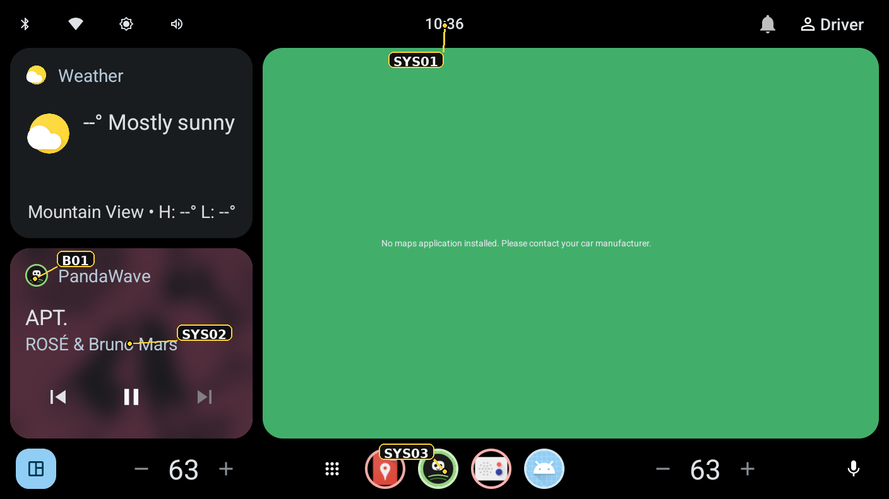
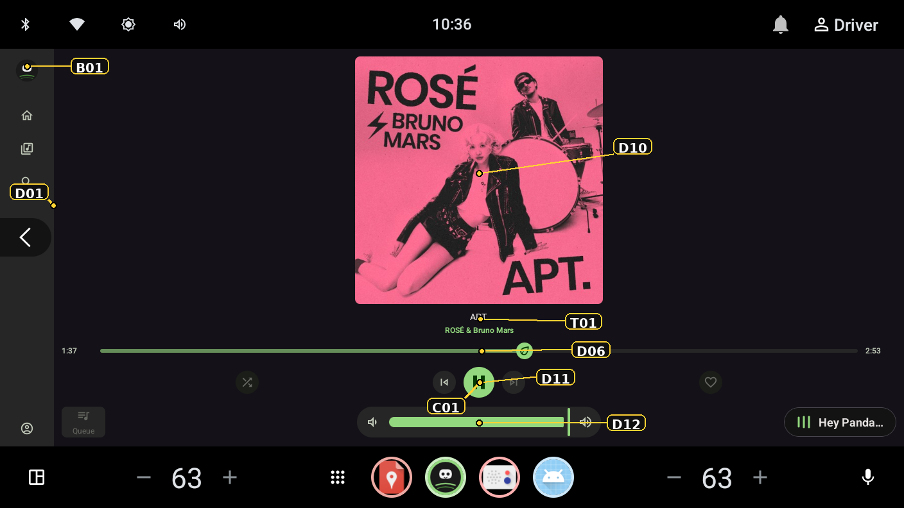
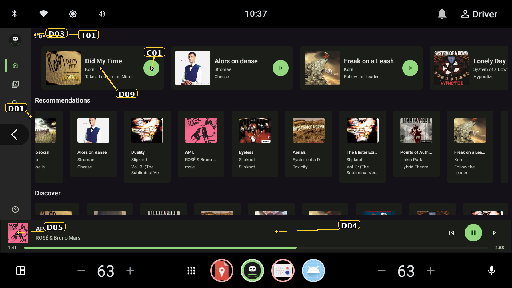
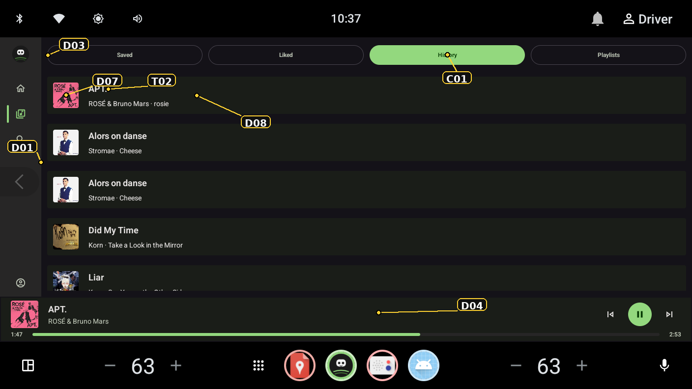
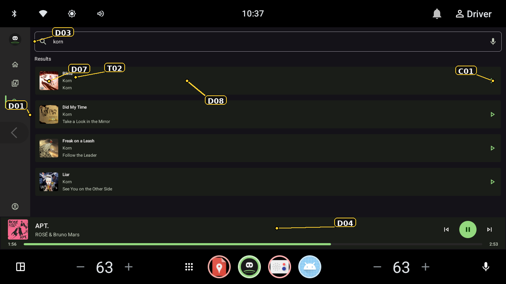

# Original annotated screenshots and corrected mappings

Images are preserved from the supplied ZIP. IDs identify **visual families**, sometimes several resources, rather than a one-to-one resource mapping. The corrected mappings below take precedence over the original draft. Open the linked reference capture when a callout obscures the UI.

### 3.1 Indicator legend and current mappings

| ID | Visual family | Resource or interpretation |
| --- | --- | --- |
| C01 | Primary accent | `color/pandawave_theme_<active_theme>_primary` |
| C02 | Main app surface | `color/pandawave_theme_<active_theme>_surface`; not marked in these six images |
| C03 | Container region | Inspect that component: it may use `surface`, `surfaceVariant`, or a Material default; **not a verified mapping to `surface_container`** |
| C04 | Foreground text/icon | `color/pandawave_theme_<active_theme>_on_surface`; not marked in these six images |
| D01 | Rail width | `dimen/pandawave_navigation_rail_width` |
| D02 | Selected rail indicator | `pandawave_navigation_selected_indicator_*`; no D02 callout in supplied images |
| D03 | Page inset | `dimen/pandawave_app_content_padding`; internal child padding can also contribute |
| D04 | Mini-player height | `dimen/pandawave_miniplayer_height` |
| D05 | Mini-player artwork | `dimen/pandawave_miniplayer_artwork_size` |
| D06 | Progress track | `dimen/pandawave_progress_track_height`; thumb has its own `pandawave_progress_thumb_size` |
| D07 | Media-row artwork | `dimen/pandawave_media_row_artwork_size` |
| D08 | Media-row minimum height | `dimen/pandawave_media_row_min_height` |
| D09 | Home tile geometry | `pandawave_media_tile_hero_*` for the large horizontal tile indicated in F04; `standard_*` / `compact_*` for other tile variants |
| D10 | Now Playing artwork | Current panel fills available space and uses `min(maxWidth, maxHeight)`; the declared `pandawave_now_playing_artwork_standard` / `compact` tokens are **not read by this panel** |
| D11 | Transport geometry | `pandawave_now_playing_primary_button`, `secondary_transport_size`, `transport_spacing` |
| D12 | Volume geometry | `pandawave_volume_control_height` and `max_width` |
| T01 | Text marker | F04 section heading uses section-title styling; **F03's track title uses `pandawave_type_body_*` in current code** |
| T02 | Text marker | Inspect the indicated component; body/title/control-label styles differ between row implementations |
| T03 / T04 | Metadata / display families | `pandawave_type_metadata_*` / `pandawave_type_display_*`; not marked in supplied images |
| B01 | PandaWave identity | In-app rail logo: `pandawave_ic_logo`; launcher-hosted identity needs icon-path verification; paw is a separate play/pause asset |
| B02 / B03 | Launcher / splash | Launcher foreground and monochrome / splash mark; not separately marked in supplied images |
| SYS01 | AAOS top strip | System-owned |
| SYS02 | Launcher media card | System owns layout; PandaWave supplies media data and app identity |
| SYS03 | AAOS dock / HVAC | System-owned layout, potentially displaying an app-supplied icon |
| L01–L03 / M01–M03 | Layout limits / motion | Catalog-only references; still images cannot demonstrate these behaviors |

### F01 — Authenticated Profile

[Reference capture](reference/F01-profile-authenticated.png). Covers rail, page inset, account rows and mini-player. C03 is a region marker, not proof of a specific palette token. Account copy and data are not overlayable strings. This capture contains the supplied account email and session details; use a demo account for an external OEM edition.

### F02 — AAOS launcher

[Reference capture](reference/F02-aaos-launcher.png). The clock, media-card geometry, map pane and bottom controls belong to system packages. The card's logo does not prove that `pandawave_ic_logo` is the resource loaded by this launcher; verify the adaptive-icon path on the target image.

### F03 — Now Playing

[Reference capture](reference/F03-now-playing.png). Use D10–D12 to check artwork and transport geometry. Current artwork size follows the remaining layout space, so changing the declared compact/standard artwork tokens alone is not a demonstrated way to resize it. The T01 marker points to the track title; current `NowPlayingTrackMetadata` uses the **body** style there and **control-label** style for the detail line. Album art is runtime media content.

### F04 — Home

[Reference capture](reference/F04-home.png). Compare tile variants independently. D09 points at a large horizontal tile; the original draft's standard-tile-only mapping was too narrow. T01 and D03 overlap visually near the upper-left heading; consult the reference capture.

### F05 — Library / History

[Reference capture](reference/F05-library-history.png). Useful for row minimum height, artwork bounds, tab contrast and mini-player alignment. A minimum height is a lower bound, not a promise that all rows render at exactly that height.

### F06 — Search

[Reference capture](reference/F06-search.png). Check input, results, play actions and text truncation independently. Different search/history row implementations can use different text styles despite sharing the T02 marker.

Return to the [screen-by-screen guide](RRO_GUIDE.md#3-screen-by-screen-resource-guide).
