# PandaWave Runtime Resource Overlay Guide

**For personal development and OEM integration · 7 September 2026**

| Contract identity | Value |
| --- | --- |
| Target APK package | `com.adrianrusu.pandawave` |
| Overlayable group / manifest `targetName` | `PandaWaveDesignTokens` |
| Resource owner in source | `core/designsystem/src/main/res` |
| Source snapshot | `ac64500c3c3f77831078bdc626cefc2dd87fb957` |
| Application minimum Android version | Android 13 / API 33 |
| Current eligibility policy | `public` for every resource in this guide |
| Inventory | 216 resources: 89 color, 99 dimen, 5 drawable, 6 fraction, 17 integer |
| Evidence | Source inspection, actual emulator screenshots, and a built/installed/enabled/rolled-back two-resource canary |

This guide describes the existing resource contract for personal development and OEM integration. Section 3 pairs screen descriptions, actual screenshots and resource tables. New captures use the connected AAOS emulator; retained original references are labeled separately. Resource defaults come from source, not image measurements. See [capture evidence](CAPTURE_EVIDENCE.md) for device details, validation results and remaining capture limits.

## Contents

1. [Choose your workflow](#1-choose-your-workflow)
2. [Ownership and resource resolution](#2-ownership-and-resource-resolution)
3. [Screen-by-screen resource guide](#3-screen-by-screen-resource-guide)
4. [Complete resource catalog](#4-complete-resource-catalog)
5. [Personal development workflow](#5-personal-development-workflow)
6. [OEM integration workflow](#6-oem-integration-workflow)
7. [Authoring rules and recipes](#7-authoring-rules-and-recipes)
8. [Verification and troubleshooting](#8-verification-and-troubleshooting)
9. [Additional images and handoff evidence](#9-additional-images-and-handoff-evidence)
10. [Maintenance and known gaps](#10-maintenance-and-known-gaps)
11. [Sources](#11-sources)

## 1. Choose your workflow

| Intent | Recommended starting point | Result |
| --- | --- | --- |
| Choose a built-in appearance for yourself | PandaWave's theme preference: System Default or one of the four named themes | App preference selects a palette; no overlay APK needed |
| Experiment with resource replacements on your development device | Small, separately named mutable overlay; [section 5](#5-personal-development-workflow) | Reversible resource test using ADB |
| Supply production OEM branding | Resource-only overlay integrated into the OEM image; [section 6](#6-oem-integration-workflow) | Product-owned appearance, activation and update policy |
| Inspect the full existing sample | `:rro:bamboo-grove-overlay` | Reference implementation mirroring the complete contract |

The current sample uses `android:isStatic="true"`, priority `1`, package `com.adrianrusu.pandawave.rro.bamboogrove`, and matching target resource names. It has no explicit resources map. Do not use its static manifest as the mutable personal example. Its full copy of the contract is useful for consistency testing, but it also replaces values that a small OEM overlay may prefer to inherit.

`public.xml` publishes resource names to consumers. The `public` policy in `overlayable.xml` controls overlay eligibility; these are separate concepts. Eligibility does not grant an ordinary app permission to enable arbitrary overlays. For personal experiments, use an ADB-enabled development device whose overlay manager permits the operation. [Android RRO contract and policy](https://source.android.com/docs/core/runtime/rros)

## 2. Ownership and resource resolution

| Surface or behavior | Owner / mechanism | What this overlay can change |
| --- | --- | --- |
| PandaWave rail, rows, cards, playback, typography | Compose reads the design-token model | Resource-backed values actually consumed by that UI |
| Named app theme | `PandaWaveThemeId` and the theme preference | Values inside that named palette; not the stored preference |
| Platform theme attributes | App XML theme reads generic color aliases | Those alias values for the applicable Android configuration |
| Startup branding | App splash theme and adaptive-icon resource references | Exposed drawable layers, splash and launcher background colors |
| AAOS status strip, HVAC/dock, launcher card geometry | SystemUI / launcher packages | No layout or styling control through the PandaWave target |
| Artwork, track title, account details | Runtime data | No replacement through this contract |
| Navigation destinations, auth, transport availability, backend behavior | Kotlin / Rust / platform logic | No code or policy replacement |
| App display label and localized strings | App / feature string resources | Not in this overlayable group |

### 2.1 The actual Compose path

```text
Overlay package + target resources
             |
      Android Resources
             |
ResourceDesignTokenProvider.load(activeThemeId)
             |
    PandaWaveDesignTokens
             |
    PandaWaveTheme / Compose UI
```

The provider reads dimensions into pixel integers, fractions with base `1`, typography into `TextStyle`, and numeric motion/restriction values into tokens. `PandaWaveTheme` remembers tokens by context and theme ID. During verification, relaunch the app after enabling or disabling an overlay so cached tokens cannot confuse the result.

### 2.2 Named palettes and Android night mode are different inputs

| App theme selection | Named resource prefix read by Compose |
| --- | --- |
| Bamboo Grove Light | `pandawave_theme_bamboo_grove_light_` |
| Moonlit Bamboo Dark | `pandawave_theme_moonlit_bamboo_dark_` |
| Forest Tech Light | `pandawave_theme_forest_tech_light_` |
| Forest Tech Dark | `pandawave_theme_forest_tech_dark_` |
| System Default, system light | Bamboo Grove Light |
| System Default, system dark | Moonlit Bamboo Dark |

All four named palettes are defined in `values`. Separately, `pandawave_color_*` aliases resolve to Bamboo Grove Light in `values` and Moonlit Bamboo Dark in `values-night`. Selecting Forest Tech Dark in the app does not rewrite those aliases.

The provider reads **10 of the 16 color roles** in each named palette: `primary`, `on_primary`, `secondary`, `on_secondary`, `surface`, `on_surface`, `surface_container_high`, `on_surface_variant`, `error`, and `on_error`. `surface_container_high` becomes the token/Compose role **`surfaceVariant`**. The remaining six roles are declared but are not loaded into this provider's color model. Some have XML alias consumers. Do not assume a resource named `surface_container` controls every card.

Likewise, the five XML color selectors and three `pandawave_state_*_alpha` fractions exist in the contract, but no production code/XML consumer of those selectors was found in this source snapshot. Current Compose navigation uses `MaterialTheme` colors directly. Changing the selector alone is therefore not a demonstrated way to change that navigation or its disabled state.

## 3. Screen-by-screen resource guide

Choose the part of the app you want to customize. Each section pairs an image with a short explanation and its relevant resource table. Shared resources appear in several sections because changing them can affect several screens. The [complete catalog](RESOURCE_CATALOG.md) retains all 216 resources and their source/consumer links.

**Images:** Screenshots live under `docs/images/<section>/` with descriptive lowercase filenames. Captions identify the actual state and resource-consumption limits. Comparisons use separate original PNGs with Markdown captions. The [image index](../images/README.md) records captured, retained-reference and unavailable states.

Use a full screen for an overview and a close-up for a component detail. Keep enough surrounding space to show bounds and alignment. No screenshot proves resource consumption on its own; the caveats below retain the findings from source inspection.

- [3.1 Navigation rail and page spacing](#31-navigation-rail-and-page-spacing)
- [3.2 Home overview](#32-home-overview)
- [3.3 Home featured cards](#33-home-featured-cards)
- [3.4 Home recommendation cards](#34-home-recommendation-cards)
- [3.5 Compact media cards](#35-compact-media-cards)
- [3.6 Library and history rows](#36-library-and-history-rows)
- [3.7 Library categories and playlists](#37-library-categories-and-playlists)
- [3.8 Search input and results](#38-search-input-and-results)
- [3.9 Now Playing artwork and track information](#39-now-playing-artwork-and-track-information)
- [3.10 Now Playing transport controls](#310-now-playing-transport-controls)
- [3.11 Now Playing progress and volume](#311-now-playing-progress-and-volume)
- [3.12 Persistent mini-player](#312-persistent-mini-player)
- [3.13 Profile and account preferences](#313-profile-and-account-preferences)
- [3.14 Login and registration forms](#314-login-and-registration-forms)
- [3.15 Empty, loading and error feedback](#315-empty-loading-and-error-feedback)
- [3.16 Ambient artwork and visualizer](#316-ambient-artwork-and-visualizer)
- [3.17 Ambient idle and active transitions](#317-ambient-idle-and-active-transitions)
- [3.18 Voice indicator and waveform](#318-voice-indicator-and-waveform)
- [3.19 Focus and disabled controls](#319-focus-and-disabled-controls)
- [3.20 Driving-restricted screens](#320-driving-restricted-screens)
- [3.21 AAOS launcher and ownership boundaries](#321-aaos-launcher-and-ownership-boundaries)
- [3.22 Splash screen and launcher icon variants](#322-splash-screen-and-launcher-icon-variants)
- [3.23 Theme colors across the app](#323-theme-colors-across-the-app)
- [3.24 Typography and long text](#324-typography-and-long-text)
- [3.25 Before and after an overlay](#325-before-and-after-an-overlay)

### 3.1 Navigation rail and page spacing

Start here when changing the width of the app shell or the selected navigation marker. Include the page edge so rail width and content padding can be compared.

**Image path:** `docs/images/navigation/navigation_rail_selected_destination.png`  
**Status:** Captured from the emulator on 7 September 2026.

Home selected in the left rail; page content starts to its right.

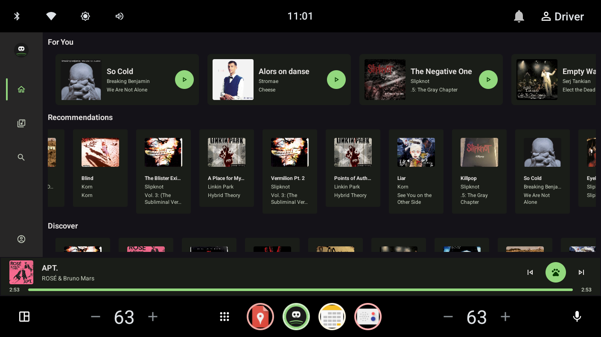

| What you are changing | Resource | Default |
| --- | --- | --- |
| Rail width | `pandawave_navigation_rail_width` | `100dp` |
| Logo size | `pandawave_navigation_logo_size` | `64dp` |
| Navigation item height | `pandawave_navigation_item_height` | `76dp` |
| Gap between items | `pandawave_navigation_item_spacing` | `12dp` |
| Selected marker width | `pandawave_navigation_selected_indicator_width` | `4dp` |
| Selected marker height | `pandawave_navigation_selected_indicator_height` | `52dp` |
| Selected marker inset | `pandawave_navigation_selected_indicator_inset` | `14dp` |
| Selected marker corner | `pandawave_navigation_selected_indicator_corner` | `2dp` |
| Page inset | `pandawave_app_content_padding` | `12dp` |

[All resource definitions and read paths](RESOURCE_CATALOG.md) · [Image checklist](../images/README.md)

### 3.2 Home overview

Use this full-screen view to compare the spacing between sections and the shared page inset. The next three sections cover each card variant separately.

**Image path:** `docs/images/home/home_recommendations_overview.png`  
**Status:** Captured from the emulator on 7 September 2026.

Home overview: For You hero cards, compact recommendation tiles and the persistent mini-player.


| What you are changing | Resource | Default |
| --- | --- | --- |
| Page inset | `pandawave_app_content_padding` | `12dp` |
| Section spacing | `pandawave_media_section_spacing` | `16dp` |
| Carousel spacing | `pandawave_media_carousel_spacing` | `16dp` |
| Card padding | `pandawave_card_padding` | `12dp` |
| Card corner | `pandawave_shape_corner_md` | `8dp` |
| Card resting elevation | `pandawave_elevation_card_resting` | `1dp` |

[All resource definitions and read paths](RESOURCE_CATALOG.md) · [Image checklist](../images/README.md)

### 3.3 Home featured cards

These resources describe the hero media-card variant. Minimum dimensions are lower bounds; content and parent layout can make the rendered card larger.

**Image path:** `docs/images/home/home_featured_media_card.png`  
**Status:** Captured from the emulator on 7 September 2026.

The horizontal For You cards at the top use the hero resource family. The So Cold card shows complete artwork, metadata and play action.


| What you are changing | Resource | Default |
| --- | --- | --- |
| Minimum card width | `pandawave_media_tile_hero_min_width` | `280dp` |
| Maximum card width | `pandawave_media_tile_hero_max_width` | `340dp` |
| Minimum card height | `pandawave_media_tile_hero_min_height` | `120dp` |
| Artwork height | `pandawave_media_tile_hero_artwork_height` | `96dp` |
| Gap between cards | `pandawave_media_carousel_spacing` | `16dp` |

**Current implementation:** The For You row calls BambooMediaHeroCard.

[All resource definitions and read paths](RESOURCE_CATALOG.md) · [Image checklist](../images/README.md)

### 3.4 Home recommendation cards

These standard media-card sizes remain part of the published resource contract, but they do not control the currently rendered Home recommendations.

**Image path (reserved):** `docs/images/home/home_standard_recommendation_cards.png`  
**Status:** Unavailable in this capture session.

No production renderer was found using the four standard tile sizing tokens. Home recommendations use the compact variant in section 3.5. There is no correct standard-card screenshot to supply for this build.

| What you are changing | Resource | Default |
| --- | --- | --- |
| Minimum card width | `pandawave_media_tile_standard_min_width` | `146dp` |
| Maximum card width | `pandawave_media_tile_standard_max_width` | `198dp` |
| Minimum card height | `pandawave_media_tile_standard_min_height` | `126dp` |
| Artwork height | `pandawave_media_tile_standard_artwork_height` | `84dp` |
| Gap between cards | `pandawave_media_carousel_spacing` | `16dp` |

**Current implementation:** The provider loads the standard sizing values, but no production UI field reader was found. Do not use this table to resize the compact recommendation tiles.

[All resource definitions and read paths](RESOURCE_CATALOG.md) · [Image checklist](../images/README.md)

### 3.5 Compact media cards

These resources describe the compact media-card variant. Minimum dimensions are lower bounds; content and parent layout can make the rendered card larger.

**Image path:** `docs/images/home/home_compact_media_cards.png`  
**Status:** Captured from the emulator on 7 September 2026.

The Recommendations row uses BambooMediaTile and the compact sizing resources, including its 68dp artwork height. Long titles are ellipsized.


| What you are changing | Resource | Default |
| --- | --- | --- |
| Minimum card width | `pandawave_media_tile_compact_min_width` | `74dp` |
| Maximum card width | `pandawave_media_tile_compact_max_width` | `132dp` |
| Minimum card height | `pandawave_media_tile_compact_min_height` | `96dp` |
| Artwork height | `pandawave_media_tile_compact_artwork_height` | `68dp` |
| Gap between cards | `pandawave_media_carousel_spacing` | `16dp` |

**Current implementation:** Home Recommendations and Discover call BambooMediaTile, which reads the compact resource family.

[All resource definitions and read paths](RESOURCE_CATALOG.md) · [Image checklist](../images/README.md)

### 3.6 Library and history rows

Compare artwork size and row density here. Typography depends on the row implementation; the current catalog documents the shared semantic text styles.

**Image path:** `docs/images/library/library_history_media_rows.png`  
**Status:** Original supplied reference retained.

Original supplied reference; build, theme, density and capture date were not recorded. The current account has no listening-history rows, so the populated original is retained.

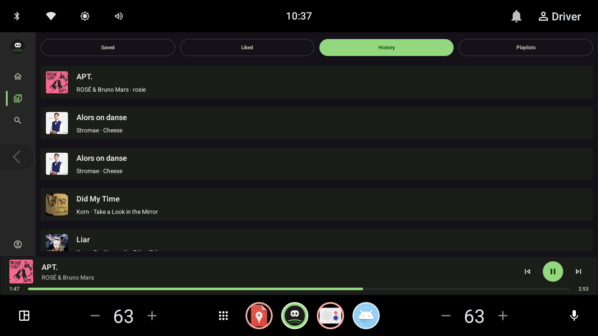

| What you are changing | Resource | Default |
| --- | --- | --- |
| Artwork size | `pandawave_media_row_artwork_size` | `52dp` |
| Minimum row height | `pandawave_media_row_min_height` | `72dp` |
| Card padding | `pandawave_card_padding` | `12dp` |
| Body text size | `pandawave_type_body_size` | `14sp` |
| Metadata text size | `pandawave_type_metadata_size` | `12sp` |

[All resource definitions and read paths](RESOURCE_CATALOG.md) · [Image checklist](../images/README.md)

### 3.7 Library categories and playlists

The shared BambooCategoryCard implementation reads the category sizes below, but no feature route calls it in this snapshot. The actual Playlists form is shown for orientation; overriding these category dimensions is not demonstrated to change that form.

**Image path:** `docs/images/library/library_playlist_form_empty_state.png`  
**Status:** Captured from the emulator on 7 September 2026.

Actual Playlists screen with empty name/description fields, disabled Create action and no playlists. This form does not demonstrate category-card sizing.

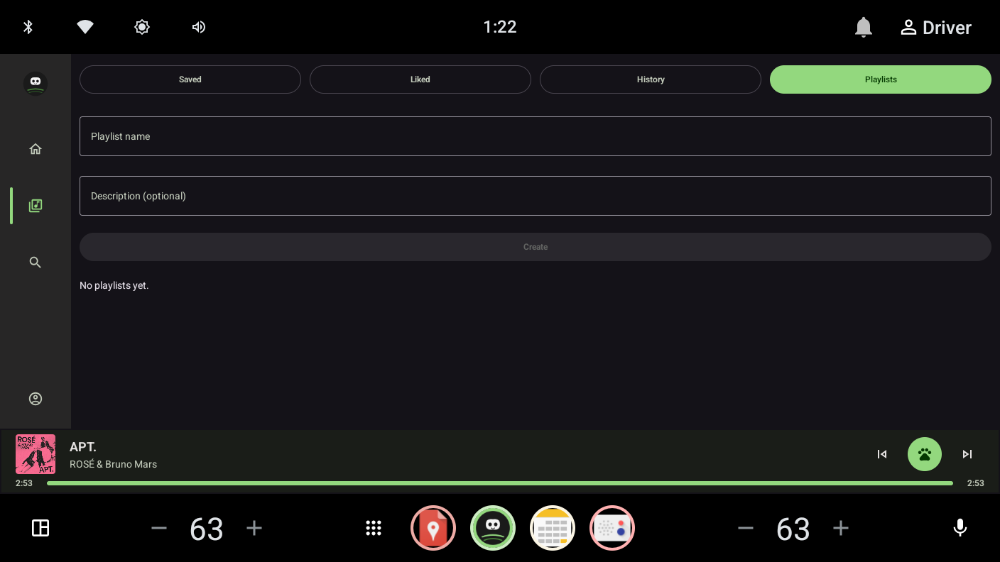

| What you are changing | Resource | Default |
| --- | --- | --- |
| Minimum card width | `pandawave_category_card_min_width` | `162dp` |
| Maximum card width | `pandawave_category_card_max_width` | `228dp` |
| Minimum card height | `pandawave_category_card_min_height` | `112dp` |
| Card padding | `pandawave_card_padding` | `12dp` |
| Heading size | `pandawave_type_section_title_size` | `18sp` |

[All resource definitions and read paths](RESOURCE_CATALOG.md) · [Image checklist](../images/README.md)

### 3.8 Search input and results

Check page alignment, result artwork and row bounds together. Search input behavior and query text are not resource-overlay features.

**Image path:** `docs/images/search/search_query_and_media_results.png`  
**Status:** Captured from the emulator on 7 September 2026.

Search for korn, with four result rows and the keyboard dismissed. The query field remains focused.

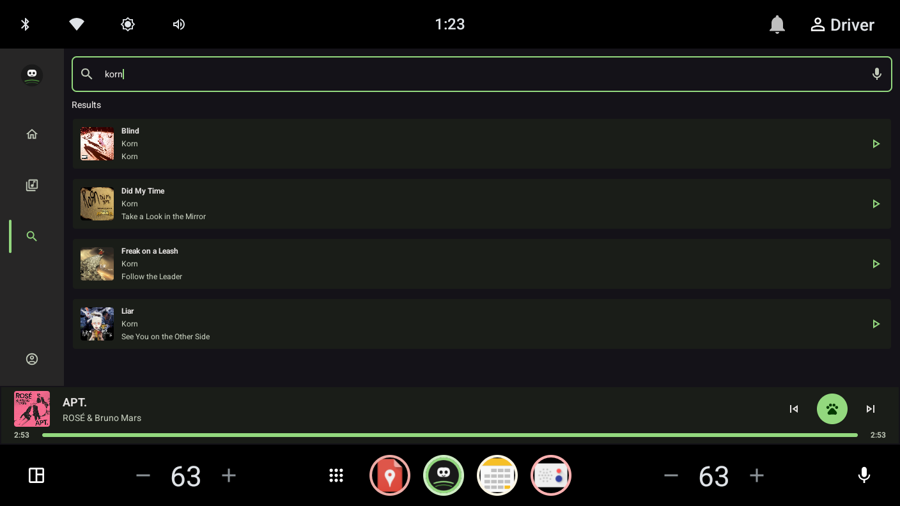

| What you are changing | Resource | Default |
| --- | --- | --- |
| Page inset | `pandawave_app_content_padding` | `12dp` |
| Result artwork size | `pandawave_media_row_artwork_size` | `52dp` |
| Minimum result-row height | `pandawave_media_row_min_height` | `72dp` |
| Small icon size | `pandawave_icon_size_sm` | `20dp` |
| Body text size | `pandawave_type_body_size` | `14sp` |
| Metadata text size | `pandawave_type_metadata_size` | `12sp` |

[All resource definitions and read paths](RESOURCE_CATALOG.md) · [Image checklist](../images/README.md)

### 3.9 Now Playing artwork and track information

The current track title uses the body style; its detail line uses control-label styling. Artwork fills the remaining layout space, so text and control geometry can affect the space available to it.

**Image path:** `docs/images/nowplaying/now_playing_artwork_and_track_details.png`  
**Status:** Captured from the emulator on 7 September 2026.

APT. on Now Playing, with artwork, title and artist line. The track is at its end.

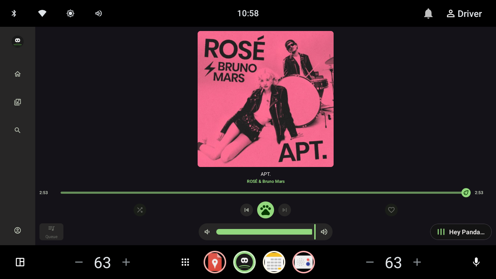

| What you are changing | Resource | Default |
| --- | --- | --- |
| Track-title size | `pandawave_type_body_size` | `14sp` |
| Track-title line height | `pandawave_type_body_line_height` | `20sp` |
| Track-title weight | `pandawave_type_body_weight` | `400` |
| Detail-line size | `pandawave_type_control_label_size` | `12sp` |
| Detail-line height | `pandawave_type_control_label_line_height` | `16sp` |
| Detail-line weight | `pandawave_type_control_label_weight` | `600` |
| Page inset | `pandawave_app_content_padding` | `12dp` |
| Declared standard artwork size | `pandawave_now_playing_artwork_standard` | `316dp` |
| Declared compact artwork size | `pandawave_now_playing_artwork_compact` | `202dp` |

**Current implementation:** The current artwork panel does not read the declared standard/compact artwork sizes. Do not present these two resources as fixed artwork-size controls.

[All resource definitions and read paths](RESOURCE_CATALOG.md) · [Image checklist](../images/README.md)

### 3.10 Now Playing transport controls

Use this detail view to compare the main playback button, secondary controls and spacing. Button artwork and the touch target are separate resources.

**Image path:** `docs/images/nowplaying/now_playing_transport_controls.png`  
**Status:** Captured from the emulator on 7 September 2026.

The center transport group shows Previous, the paw-shaped Play control and disabled Next. Shuffle and Favorite are also unavailable.


| What you are changing | Resource | Default |
| --- | --- | --- |
| Primary playback button | `pandawave_now_playing_primary_button` | `48dp` |
| Secondary transport size | `pandawave_now_playing_secondary_transport_size` | `36dp` |
| Transport spacing | `pandawave_now_playing_transport_spacing` | `12dp` |
| Medium touch target | `pandawave_touch_target_md` | `48dp` |
| Play/pause paw artwork | `pandawave_ic_panda_paw` | `Vector 48dp × 48dp; viewport 24 × 24` |

[All resource definitions and read paths](RESOURCE_CATALOG.md) · [Image checklist](../images/README.md)

### 3.11 Now Playing progress and volume

Track thickness, thumb size and footer geometry are independent. Validate the available width on the target head unit.

**Image path:** `docs/images/nowplaying/now_playing_progress_volume_and_footer.png`  
**Status:** Captured from the emulator on 7 September 2026.

Progress and time labels sit above transport; the footer contains Queue, volume and the decorative Hey Panda indicator.


| What you are changing | Resource | Default |
| --- | --- | --- |
| Progress track thickness | `pandawave_progress_track_height` | `6dp` |
| Progress thumb size | `pandawave_progress_thumb_size` | `26dp` |
| Volume control height | `pandawave_volume_control_height` | `40dp` |
| Maximum volume-control width | `pandawave_volume_control_max_width` | `380dp` |
| Footer height | `pandawave_now_playing_footer_height` | `52dp` |
| Quick-action width | `pandawave_now_playing_quick_action_width` | `68dp` |
| Quick-action height | `pandawave_now_playing_quick_action_height` | `48dp` |

[All resource definitions and read paths](RESOURCE_CATALOG.md) · [Image checklist](../images/README.md)

### 3.12 Persistent mini-player

The mini-player is shared across multiple destinations. Keep its top and bottom edges visible to judge its height and its separation from page content.

**Image path:** `docs/images/miniplayer/mini_player_artwork_metadata_and_controls.png`  
**Status:** Captured from the emulator on 7 September 2026.

The full-width bottom mini-player shows artwork, APT. metadata, transport actions and progress at the end of the track.


| What you are changing | Resource | Default |
| --- | --- | --- |
| Player height | `pandawave_miniplayer_height` | `80dp` |
| Artwork size | `pandawave_miniplayer_artwork_size` | `56dp` |
| Transport button size | `pandawave_miniplayer_transport_button_size` | `48dp` |
| Internal spacing | `pandawave_miniplayer_internal_spacing` | `6dp` |
| Progress track thickness | `pandawave_progress_track_height` | `6dp` |
| Body text size | `pandawave_type_body_size` | `14sp` |
| Metadata size | `pandawave_type_metadata_size` | `12sp` |

[All resource definitions and read paths](RESOURCE_CATALOG.md) · [Image checklist](../images/README.md)

### 3.13 Profile and account preferences

Use this section for preference-row dimensions and text hierarchy. Account values and localized labels remain runtime data or non-overlayable strings.

**Image path:** `docs/images/profile/profile_account_details_and_preferences.png`  
**Status:** Captured from the emulator on 7 September 2026.

Signed-in Profile shows account/session rows and the start of the display-name field. The screenshot contains the emulator test-account email.

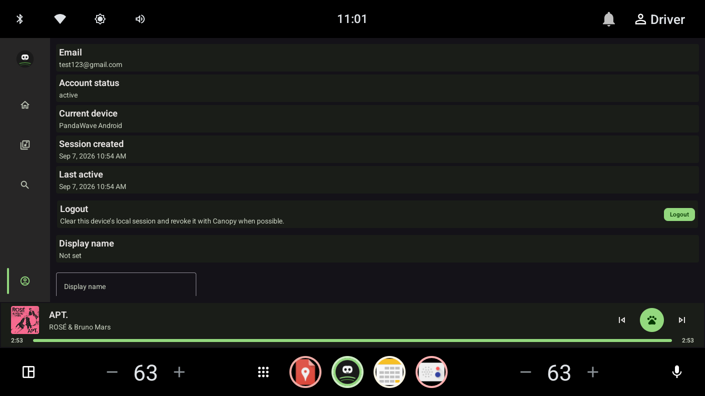

| What you are changing | Resource | Default |
| --- | --- | --- |
| Minimum preference-row height | `pandawave_preference_row_min_height` | `52dp` |
| Content padding | `pandawave_preference_content_padding` | `16dp` |
| Icon size | `pandawave_preference_icon_size` | `24dp` |
| Control width | `pandawave_preference_control_width` | `56dp` |
| Body text size | `pandawave_type_body_size` | `14sp` |
| Metadata size | `pandawave_type_metadata_size` | `12sp` |

[All resource definitions and read paths](RESOURCE_CATALOG.md) · [Image checklist](../images/README.md)

### 3.14 Login and registration forms

These are shared tokens to inspect in form layouts. There is no dedicated overlayable authentication-field resource family; exact component consumption must be verified before promising a change.

**Image path (reserved):** `docs/images/auth/authentication_form_fields_and_actions.png`  
**Status:** Unavailable in this capture session.

Not captured: the emulator is signed in. A parked, signed-out test session is needed to capture the login/registration form without revoking the existing session.

| What you are changing | Resource | Default |
| --- | --- | --- |
| Page inset | `pandawave_app_content_padding` | `12dp` |
| Shared text-width limit | `pandawave_layout_text_max_width` | `720dp` |
| Action-card minimum height | `pandawave_actionable_card_min_height` | `56dp` |
| Medium touch target | `pandawave_touch_target_md` | `48dp` |
| Body text size | `pandawave_type_body_size` | `14sp` |
| Control-label size | `pandawave_type_control_label_size` | `12sp` |
| Focus outline width | `pandawave_focus_outline_width` | `3dp` |

[All resource definitions and read paths](RESOURCE_CATALOG.md) · [Image checklist](../images/README.md)

### 3.15 Empty, loading and error feedback

Shared feedback geometry can be inspected here. Dedicated empty/error illustrations were proposed in the original draft but are not currently overlayable resources.

**Image path:** `docs/images/feedback/library_saved_empty_state.png`  
**Status:** Captured from the emulator on 7 September 2026.

Saved Library in its empty state: No saved tracks yet. This route uses a plain text message, so it does not demonstrate the shared feedback icon or geometry tokens.

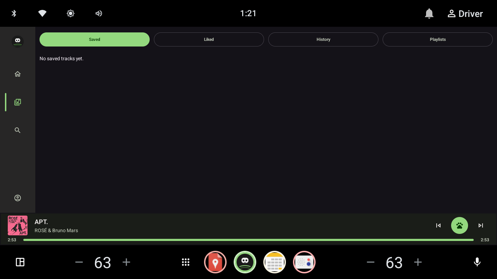

| What you are changing | Resource | Default |
| --- | --- | --- |
| Feedback icon size | `pandawave_feedback_icon_size` | `48dp` |
| Maximum feedback width | `pandawave_feedback_max_width` | `480dp` |
| Feedback spacing | `pandawave_feedback_spacing` | `16dp` |
| Heading size | `pandawave_type_section_title_size` | `18sp` |
| Body text size | `pandawave_type_body_size` | `14sp` |

[All resource definitions and read paths](RESOURCE_CATALOG.md) · [Image checklist](../images/README.md)

### 3.16 Ambient artwork and visualizer

Use this view for the ambient layout and active colors. A still frame shows geometry; use a recording to assess timing and animation.

**Image path:** `docs/images/ambient/ambient_artwork_and_idle_visualizer.png`  
**Status:** Captured from the emulator on 7 September 2026.

Ambient layout with APT. artwork and the dim idle visualizer. This is an idle frame, not an active audio-amplitude capture.

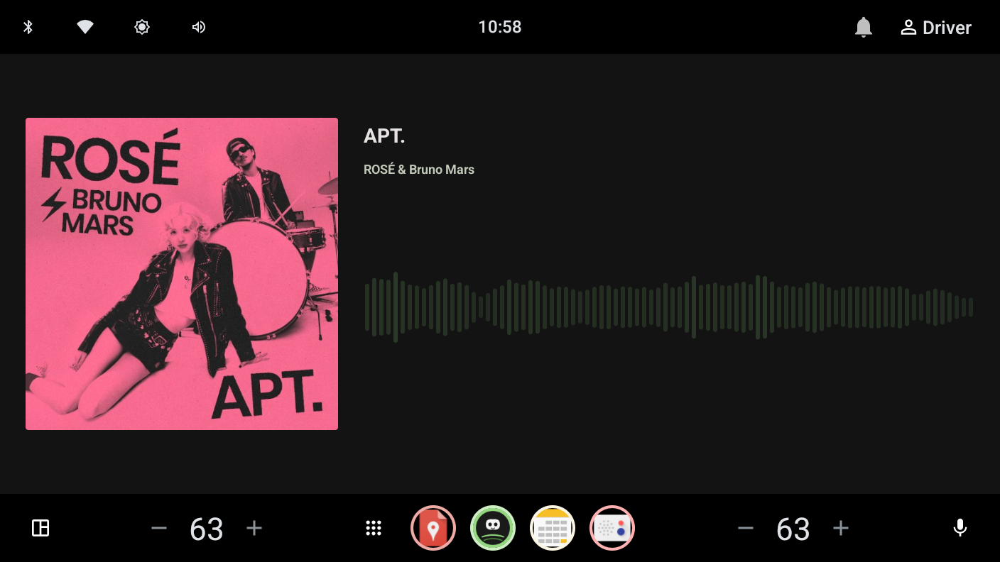

| What you are changing | Resource | Default |
| --- | --- | --- |
| Minimum artwork size | `pandawave_ambient_artwork_min_size` | `240dp` |
| Maximum artwork size | `pandawave_ambient_artwork_max_size` | `440dp` |
| Visualizer height | `pandawave_ambient_visualizer_height` | `328dp` |
| Bar width | `pandawave_ambient_visualizer_bar_width` | `6dp` |
| Bar gap | `pandawave_ambient_visualizer_bar_gap` | `4dp` |
| Bar corner radius | `pandawave_ambient_visualizer_bar_radius` | `3dp` |
| Minimum bar height | `pandawave_ambient_visualizer_min_bar_height` | `8dp` |
| Maximum bar height | `pandawave_ambient_visualizer_max_bar_height` | `350dp` |
| Active color | `pandawave_ambient_visualizer_active` | `#93D87E` |
| Idle color | `pandawave_ambient_visualizer_idle` | `#2A3A28` |

**Current implementation:** The default maximum bar height is 350dp while the visualizer height is 328dp. Inspect actual clipping rather than assuming these values define identical bounds.

[All resource definitions and read paths](RESOURCE_CATALOG.md) · [Image checklist](../images/README.md)

### 3.17 Ambient idle and active transitions

Compare opacity at rest and during activity. Entry and exit durations are milliseconds; a still-image comparison does not verify those durations.

**Image path:** `docs/images/ambient/ambient_idle_reference.png`  
**Status:** Captured from the emulator on 7 September 2026.

Idle ambient reference on Forest Tech Dark. An active amplitude-source comparison remains to be captured; a still image cannot validate transition durations.


| What you are changing | Resource | Default |
| --- | --- | --- |
| Idle opacity | `pandawave_ambient_visualizer_idle_alpha` | `45%` |
| Minimum active opacity | `pandawave_ambient_visualizer_active_min_alpha` | `35%` |
| Maximum active opacity | `pandawave_ambient_visualizer_active_max_alpha` | `95%` |
| Entry duration | `pandawave_ambient_entry_duration_millis` | `350` |
| Exit duration | `pandawave_ambient_exit_duration_millis` | `200` |

[All resource definitions and read paths](RESOURCE_CATALOG.md) · [Image checklist](../images/README.md)

### 3.18 Voice indicator and waveform

Keep indicator borders, individual bars and spacing visible. Use a recording to validate activation and cycle timing.

**Image path:** `docs/images/voice/now_playing_decorative_voice_indicator.png`  
**Status:** Captured from the emulator on 7 September 2026.

Hey Panda bars at the lower right of Now Playing. BambooVoiceIndicator is called with its default isActive=true; the bars do not indicate microphone listening.


| What you are changing | Resource | Default |
| --- | --- | --- |
| Indicator border | `pandawave_voice_indicator_border_width` | `1dp` |
| Indicator bars width | `pandawave_voice_indicator_bars_width` | `22dp` |
| Indicator bars height | `pandawave_voice_indicator_bars_height` | `22dp` |
| Bar width | `pandawave_voice_bar_width` | `3dp` |
| Bar gap | `pandawave_voice_bar_gap` | `5dp` |
| Idle bar height | `pandawave_voice_bar_idle_height` | `7dp` |
| Waveform height | `pandawave_waveform_height` | `36dp` |
| Waveform bar width | `pandawave_waveform_bar_width` | `6dp` |
| Voice cycle duration | `pandawave_motion_voice_cycle_millis` | `3000` |
| Voice activation duration | `pandawave_motion_voice_activation_millis` | `650` |

[All resource definitions and read paths](RESOURCE_CATALOG.md) · [Image checklist](../images/README.md)

**Runtime limit:** SearchRoute supplies `onVoiceClick = {}`. There is no reachable idle/listening microphone flow to photograph in this source snapshot.

### 3.19 Focus and disabled controls

Validate actual focus and unavailable states on the target input system. The XML state-alpha resources below are declared, but current Compose controls are not proven consumers of those selectors.

**Image path:** `docs/images/accessibility/keyboard_focus_and_disabled_playback_controls.png`  
**Status:** Captured from the emulator on 7 September 2026.

Keyboard Tab focus on the Library navigation item; Now Playing also shows disabled Next, Shuffle, Favorite and Queue. This is keyboard focus evidence, not a rotary-device acceptance test.

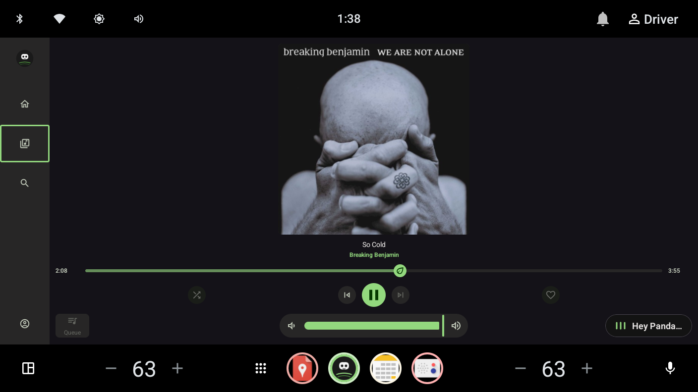

| What you are changing | Resource | Default |
| --- | --- | --- |
| Focus outline width | `pandawave_focus_outline_width` | `3dp` |
| Focus outline padding | `pandawave_focus_outline_padding` | `2dp` |
| Rotary step threshold | `pandawave_rotary_step_threshold` | `24dp` |
| Medium touch target | `pandawave_touch_target_md` | `48dp` |
| Large touch target | `pandawave_touch_target_lg` | `56dp` |
| Declared disabled opacity | `pandawave_state_disabled_alpha` | `38%` |
| Declared pressed opacity | `pandawave_state_pressed_alpha` | `88%` |
| Declared focused opacity | `pandawave_state_focus_alpha` | `100%` |

[All resource definitions and read paths](RESOURCE_CATALOG.md) · [Image checklist](../images/README.md)

### 3.20 Driving-restricted screens

This image documents observed restricted behavior. The three integers below are loaded into the token model but have no production readers of their token fields in the reviewed snapshot.

**Image path:** `docs/images/restrictions/home_under_aaos_driving_restrictions.png`  
**Status:** Captured from the emulator on 7 September 2026.

Home captured after AAOS emulate-driving-state drive reported no_dialpad, no_filtering, no_keyboard, no_setup, no_text_message and no_video. This frame does not prove enforcement or a two-column layout.

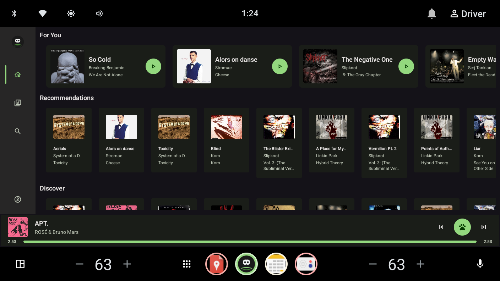

| What you are changing | Resource | Default |
| --- | --- | --- |
| Declared unrestricted browse columns | `pandawave_max_browse_columns_unrestricted` | `4` |
| Declared restricted browse columns | `pandawave_max_browse_columns_restricted` | `2` |
| Declared restricted visible actions | `pandawave_max_visible_actions_restricted` | `3` |

**Current implementation:** These are not demonstrated controls for relaxing or enforcing current driving restrictions. No provider-side range checking is present.

[All resource definitions and read paths](RESOURCE_CATALOG.md) · [Image checklist](../images/README.md)

### 3.21 AAOS launcher and ownership boundaries

The launcher owns the media-card geometry, status strip and dock. The following PandaWave resources can affect its supplied identity through the app icon path; the actual launcher behavior must be checked.

**Image path:** `docs/images/branding/aaos_launcher_pandawave_media_card.png`  
**Status:** Original supplied reference retained.

Original supplied reference; build, theme, density and capture date were not recorded. The current launcher showed Radio rather than a PandaWave media card; the original PandaWave card reference is retained.

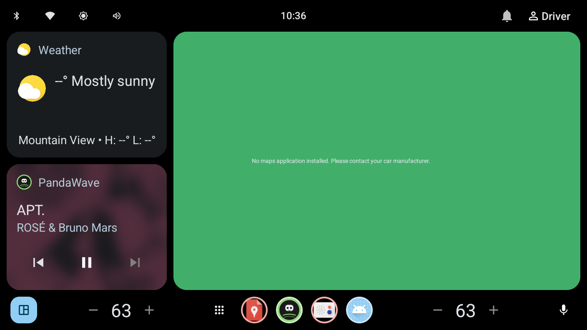

| What you are changing | Resource | Default |
| --- | --- | --- |
| Launcher foreground artwork | `pandawave_ic_launcher_foreground` | `Vector 108dp × 108dp; viewport 108 × 108` |
| Monochrome artwork | `pandawave_ic_launcher_monochrome` | `Vector 108dp × 108dp; viewport 108 × 108` |
| Launcher background | `pandawave_launcher_background` | `#93D87E` |

[All resource definitions and read paths](RESOURCE_CATALOG.md) · [Image checklist](../images/README.md)

### 3.22 Splash screen and launcher icon variants

The splash mark currently wraps the launcher foreground resource. Check both surfaces after changing it, and remember that palette colors do not automatically recolor vector paths with literal fills.

**Image path:** `docs/images/branding/pandawave_cold_start_splash.png`  
**Status:** Captured from the emulator on 7 September 2026.

Cold-start splash showing the PandaWave mark. The personal canary was enabled, but it changes only the Forest Tech Dark primary and rail width, not these splash resources. Monochrome launcher behavior was not captured.


| What you are changing | Resource | Default |
| --- | --- | --- |
| Splash mark | `pandawave_ic_splash_mark` | `Inset 0dp; @drawable/pandawave_ic_launcher_foreground` |
| Splash background | `pandawave_splash_background` | `#131313` |
| Splash exit duration | `pandawave_splash_exit_animation_duration_millis` | `220` |
| Launcher foreground | `pandawave_ic_launcher_foreground` | `Vector 108dp × 108dp; viewport 108 × 108` |
| Monochrome layer | `pandawave_ic_launcher_monochrome` | `Vector 108dp × 108dp; viewport 108 × 108` |
| Launcher background | `pandawave_launcher_background` | `#93D87E` |
| In-app logo | `pandawave_ic_logo` | `Vector 48dp × 48dp; viewport 100 × 100` |

[All resource definitions and read paths](RESOURCE_CATALOG.md) · [Image checklist](../images/README.md)

### 3.23 Theme colors across the app

Use the same screen and content in all four captures. The table uses Forest Tech Dark to show concrete resource names and values. The full catalog includes the equivalent resources for the other three themes.

**Image path:** `docs/images/themes/forest_tech_dark_theme_preferences.png`  
**Status:** Captured from the emulator on 7 September 2026.

Forest Tech Dark selected on the theme preference screen. The other three named themes are shown below at the same scroll position.

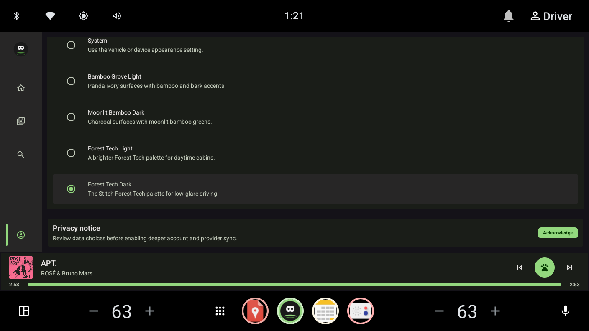

**Bamboo Grove Light**

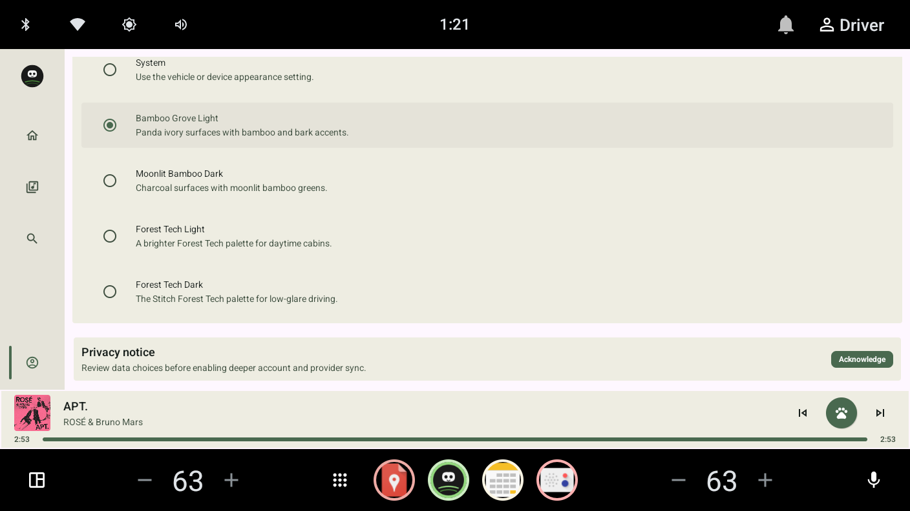

**Moonlit Bamboo Dark**

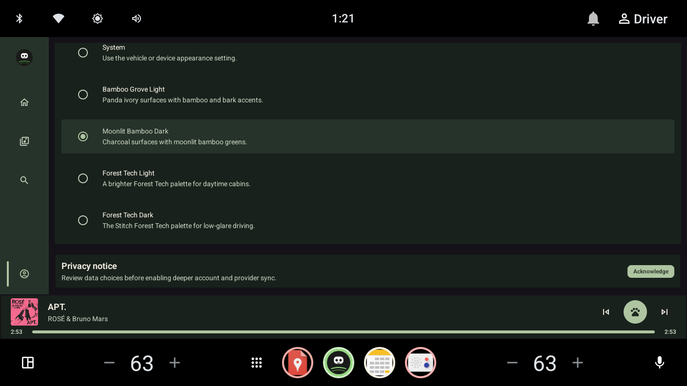

**Forest Tech Light**

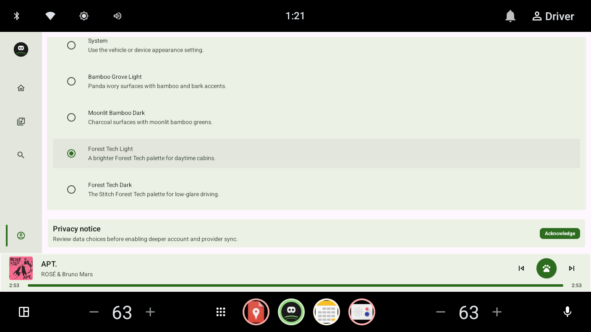

| What you are changing | Resource | Default |
| --- | --- | --- |
| Primary accent | `pandawave_theme_forest_tech_dark_primary` | `#93D87E` |
| Content on primary | `pandawave_theme_forest_tech_dark_on_primary` | `#043900` |
| Secondary accent | `pandawave_theme_forest_tech_dark_secondary` | `#C6C6C7` |
| Content on secondary | `pandawave_theme_forest_tech_dark_on_secondary` | `#2F3131` |
| Main surface | `pandawave_theme_forest_tech_dark_surface` | `#131313` |
| Main foreground | `pandawave_theme_forest_tech_dark_on_surface` | `#E5E2E1` |
| Surface variant | `pandawave_theme_forest_tech_dark_surface_container_high` | `#272626` |
| Secondary foreground | `pandawave_theme_forest_tech_dark_on_surface_variant` | `#C1C9B9` |
| Error color | `pandawave_theme_forest_tech_dark_error` | `#FFB4AB` |
| Content on error | `pandawave_theme_forest_tech_dark_on_error` | `#690005` |

**Current implementation:** App theme preference and Android night mode are separate inputs. Generic pandawave_color_* aliases do not automatically follow the selected named app theme.

[All resource definitions and read paths](RESOURCE_CATALOG.md) · [Image checklist](../images/README.md)

### 3.24 Typography and long text

Adjust each semantic style as a set: size, line height and weight. There is no overlayable font-family resource in this contract.

**Image path:** `docs/images/typography/typography_hierarchy_and_long_text.png`  
**Status:** Captured from the emulator on 7 September 2026.

Home section headings, card titles and metadata at font scale 1.0. The narrow compact cards show real title and album truncation; this is not a large-font acceptance test.


| What you are changing | Resource | Default |
| --- | --- | --- |
| Display size | `pandawave_type_display_size` | `28sp` |
| Display line height | `pandawave_type_display_line_height` | `34sp` |
| Display weight | `pandawave_type_display_weight` | `700` |
| Section heading size | `pandawave_type_section_title_size` | `18sp` |
| Section heading line height | `pandawave_type_section_title_line_height` | `24sp` |
| Section heading weight | `pandawave_type_section_title_weight` | `600` |
| Body size | `pandawave_type_body_size` | `14sp` |
| Body line height | `pandawave_type_body_line_height` | `20sp` |
| Body weight | `pandawave_type_body_weight` | `400` |
| Metadata size | `pandawave_type_metadata_size` | `12sp` |
| Metadata line height | `pandawave_type_metadata_line_height` | `16sp` |
| Metadata weight | `pandawave_type_metadata_weight` | `400` |
| Control label size | `pandawave_type_control_label_size` | `12sp` |
| Control label line height | `pandawave_type_control_label_line_height` | `16sp` |
| Control label weight | `pandawave_type_control_label_weight` | `600` |

[All resource definitions and read paths](RESOURCE_CATALOG.md) · [Image checklist](../images/README.md)

### 3.25 Before and after an overlay

This is the visual acceptance example for the personal workflow. The default column below shows target-app values before the canary; the example overlay changes them to #00D7FF and 108dp.

**Image path:** `docs/images/validation/home_cyan_primary_wide_rail_overlay.png`  
**Status:** Captured from the emulator on 7 September 2026.

Home with the personal canary enabled: cyan primary and a 108dp navigation rail. Matching baseline and Now Playing frames follow below.

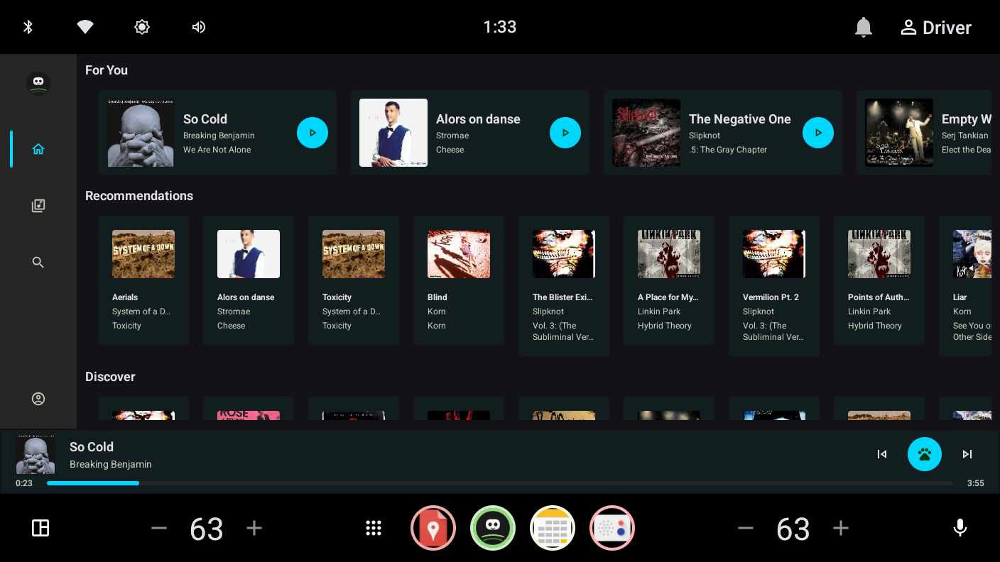

**Baseline Home: green primary, 100dp rail**

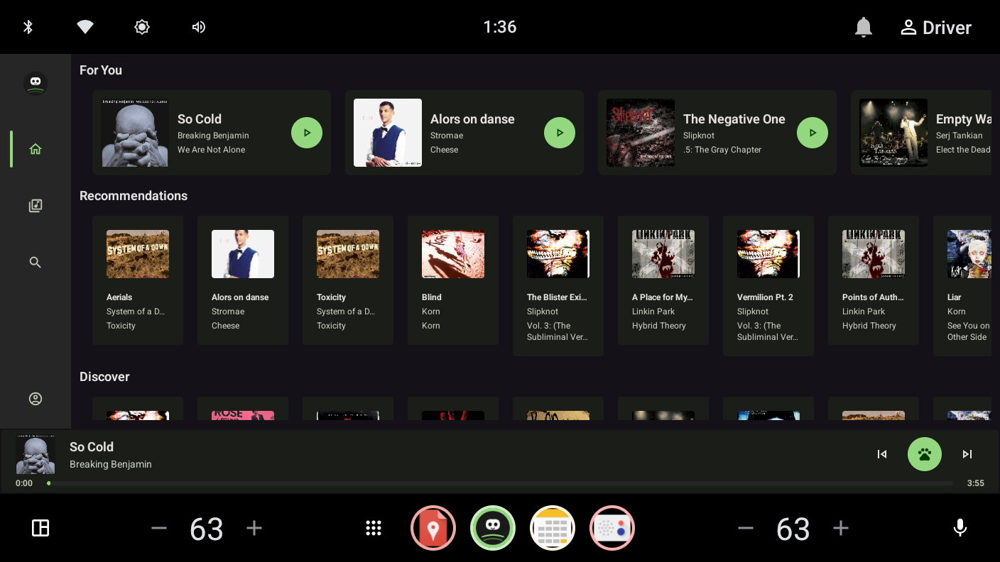

**Overlay Now Playing: cyan primary**

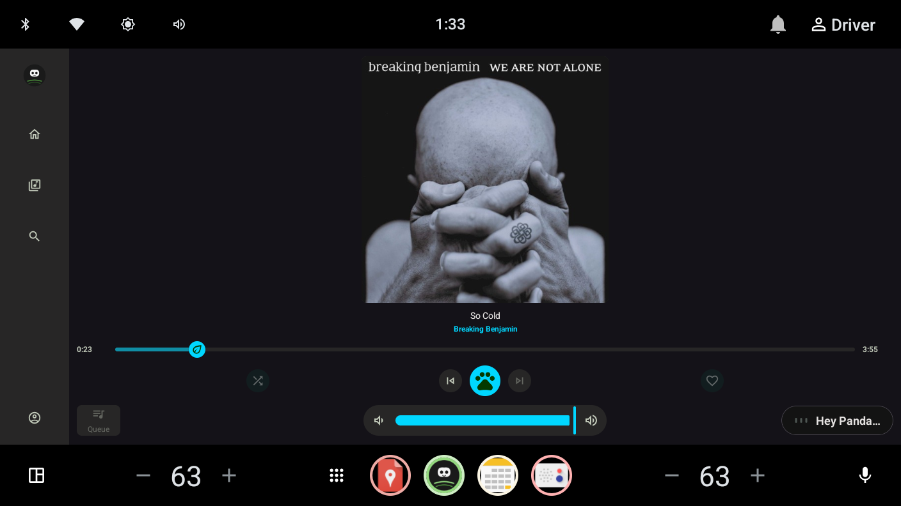

**Baseline Now Playing: green primary**

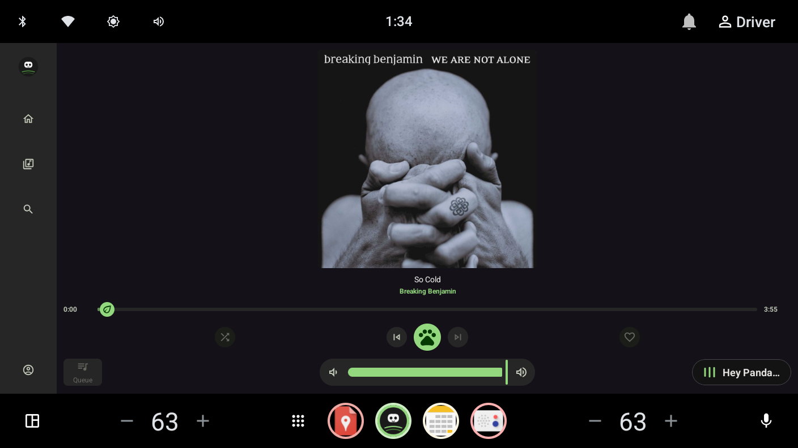

| What you are changing | Resource | Default |
| --- | --- | --- |
| Forest Tech Dark primary | `pandawave_theme_forest_tech_dark_primary` | `#93D87E` |
| Rail width | `pandawave_navigation_rail_width` | `100dp` |

[All resource definitions and read paths](RESOURCE_CATALOG.md) · [Image checklist](../images/README.md)

**Comparison conditions:** Same emulator, Forest Tech Dark, resolution, density, font scale, track and scroll position. Playback is paused at 0:00 in the baseline and 0:23 in the overlay frames; progress position and animated bars must not be interpreted as overlay effects. The canary was disabled and removed after capture. See [capture evidence](CAPTURE_EVIDENCE.md) for resolved values and limits.

## 4. Complete resource catalog

The [full resource catalog](RESOURCE_CATALOG.md) contains all **216 overlayable resources**, their base/night values and links to definitions and current consumers. Use the [CSV inventory](resource-catalog.csv) for filtering or an OEM change sheet.

The screen tables above are the practical starting point. The full catalog also retains declared resources with no demonstrated UI consumer, all four named palettes, selectors and platform aliases. The [original annotated screenshot appendix](ANNOTATED_REFERENCE.md) preserves the supplied callouts and their corrected interpretation.

## 5. Personal development workflow

Use a separate mutable package for experiments. The [personal overlay example](examples/personal-overlay/AndroidManifest.xml) changes Forest Tech Dark primary to cyan and rail width to `108dp`. Keep the app on **Forest Tech Dark** for the color canary. The rail change is independent of the selected palette.

### 5.1 Build the resource-only example

The included example uses explicit target mapping and no Kotlin/Java dependencies. Its files are complete inputs for the Android SDK tools below. The example has been checked against the declared resource names. The personal example was compiled, aligned, signed, installed and enabled on the API 35 AAOS emulator. Both canary lookups and visible changes were verified, then baseline values were restored and the test package removed. This does not validate an OEM image, release APK or every resource.

```text
examples/personal-overlay/
  AndroidManifest.xml
  res/xml/overlays.xml
  res/values/canary.xml
```

Run PowerShell from that example directory. Set the two paths to installed SDK versions; API 33 or newer is sufficient for these example resources. These commands need `aapt2.exe`, `zipalign.exe`, `apksigner.bat`, and Java `keytool` on the host. The key below is for disposable local development only.

```powershell
$rroTools = 'C:\path\to\Android\Sdk\build-tools\<installed-version>'
$rroPlatformJar = 'C:\path\to\Android\Sdk\platforms\android-<installed-api>\android.jar'
New-Item -ItemType Directory -Force -Path out | Out-Null
& "$rroTools\aapt2.exe" compile --dir res -o out\compiled.zip
& "$rroTools\aapt2.exe" link -o out\unsigned.apk -I $rroPlatformJar --manifest AndroidManifest.xml --no-resource-deduping --no-resource-removal out\compiled.zip
& "$rroTools\zipalign.exe" -f 4 out\unsigned.apk out\aligned.apk
# Generate once, and reuse the same key when updating this installed package.
keytool -genkeypair -keystore out\personal-rro.jks -alias personal-rro -keyalg RSA -keysize 2048 -validity 365 -dname 'CN=PandaWave Local RRO'
& "$rroTools\apksigner.bat" sign --ks out\personal-rro.jks --ks-key-alias personal-rro --out out\pandawave-personal-rro.apk out\aligned.apk
& "$rroTools\apksigner.bat" verify --verbose out\pandawave-personal-rro.apk
```

Stop after any failed command and resolve it before continuing. For a release/OEM APK, use the OEM signing pipeline and retain the signing identity across updates. SDK tool options are documented by [AAPT2](https://developer.android.com/tools/aapt2), [zipalign](https://developer.android.com/tools/zipalign), and [apksigner](https://developer.android.com/tools/apksigner).

### 5.2 Install, enable and inspect

Use the user ID that actually runs PandaWave. AAOS may run the app under a user other than `0`; do not assume it is always `10`. With concurrent users/displays, confirm the user for the display being tested.

```powershell
adb shell am get-current-user
adb shell pm list users
adb shell dumpsys activity activities
# Set this to the confirmed PandaWave user; 10 is an example only.
$rroUser = 10
$rroTarget = 'com.adrianrusu.pandawave'
$rroPackage = 'com.example.pandawave.overlay.personal'
adb shell pm path --user $rroUser $rroTarget
adb install --user $rroUser -r out\pandawave-personal-rro.apk
adb shell cmd overlay list --user $rroUser $rroTarget
adb shell cmd overlay enable --user $rroUser $rroPackage
adb shell cmd overlay list --user $rroUser $rroTarget
adb shell cmd overlay lookup --user $rroUser --verbose $rroTarget 'com.adrianrusu.pandawave:color/pandawave_theme_forest_tech_dark_primary'
adb shell cmd overlay lookup --user $rroUser --verbose $rroTarget 'com.adrianrusu.pandawave:dimen/pandawave_navigation_rail_width'
adb shell am force-stop --user $rroUser $rroTarget
```

Reopen PandaWave from the launcher, select Forest Tech Dark and capture Home/Now Playing. The expected logical resource values are `#00D7FF` and `108dp`; lookup output formatting can differ. Inspect the resolved value, not just whether the package appears in the overlay list. The fully qualified lookup name and explicit user avoid ambiguity. [Overlay shell command implementation](https://android.googlesource.com/platform/frameworks/base/+/refs/heads/main/services/core/java/com/android/server/om/OverlayManagerShellCommand.java)

### 5.3 Roll back the experiment

```powershell
adb shell cmd overlay disable --user $rroUser $rroPackage
adb shell am force-stop --user $rroUser $rroTarget
adb shell cmd overlay lookup --user $rroUser --verbose $rroTarget 'com.adrianrusu.pandawave:color/pandawave_theme_forest_tech_dark_primary'
# Optional: remove only this personal test package for the test user.
adb shell pm uninstall --user $rroUser $rroPackage
```

Reopen and confirm baseline appearance. With other overlays enabled, rollback restores their effective value, which may differ from the source default. Record competing overlays before the test; avoid disabling unrelated packages.

## 6. OEM integration workflow

### 6.1 Define the integration contract

| Decision | Record before release |
| --- | --- |
| Target | Exact application ID, app version and resource-contract snapshot |
| Appearance scope | Supported named palettes, Android light/night aliases, startup and launcher assets |
| Device scope | AAOS release/build, HU models, displays, density, font scale and app user assignment |
| Package identity | Unique OEM overlay ID, version code/name and signing owner |
| Activation | Partition, enabled-by-default choice, mutable/immutable choice, precedence |
| Layout | Approved dimensions, rotary/focus treatment and restricted-mode behavior |
| Delivery | App/overlay compatibility matrix, OTA sequencing and rollback image |
| Acceptance | Named owner for before/after screenshots and on-device checks |

### 6.2 Product image example

The [OEM example manifest](examples/oem-overlay/AndroidManifest.xml) and [resource map](examples/oem-overlay/res/xml/overlays.xml) use a distinct package, `com.example.pandawave.overlay.oem`. Replace that example identity consistently. The example deliberately changes only two resources; extend it from the catalog according to the agreed scope.

Place the example directory inside the OEM platform source tree. The included [Android.bp](examples/oem-overlay/Android.bp) declares a `runtime_resource_overlay` module named `PandaWaveOemOverlay`. Add it to the product's `PRODUCT_PACKAGES`. Merge the supplied [config fragment](examples/oem-overlay/config.xml) into the product's existing overlay configuration at `/product/overlay/config/config.xml`; do not replace the complete configuration of an existing product. The fragment enables the OEM package and marks it immutable.

Android 11+ supports partition overlay configuration for activation, mutability and ordering. An immutable production overlay is not the toggleable development package from section 5; rollback belongs in the product update process. The platform's `runtime_resource_overlay` build rule is intended for resource-only APKs. [Android overlay configuration](https://source.android.com/docs/core/runtime/rros)

Build and sign with the OEM's platform branch and release process. Confirm the produced APK's package, manifest and resource table before inclusion, then verify its enabled state for every relevant app user after boot, user switching and app/overlay updates. For competing overlays, document effective precedence on the actual platform branch instead of relying on package installation order.

### 6.3 Current public policy and optional future hardening

The app currently puts appearance, touch targets, breakpoints, motion and restricted-layout integers under one public policy. The provider reads them without general range validation. This guide does **not** claim that an invalid or oversized restriction value is rejected at runtime.

For a future app release, the app and OEM maintainers may split eligibility within the same target group: keep selected appearance tokens public, and move approved sensitive tokens to an appropriate partition/signature policy. Such a target-app change would alter third-party compatibility and needs an explicit contract version note. It is not achieved by changing the overlay APK alone. Review multi-policy expressions carefully: alternatives are eligibility choices, not cumulative requirements. [Overlay policy semantics](https://source.android.com/docs/core/runtime/rros)

For the current release, keep safety-related defaults unless the integration's approved design requires changes, then validate the actual restricted screens. A `48dp` default in this repository is not an OEM approval or a universal automotive target-size rule.

## 7. Authoring rules and recipes

### 7.1 Types, units and configurations

| Resource kind | Authoring rule | PandaWave-specific check |
| --- | --- | --- |
| `color` | Use a color value or compatible color reference; selectors are also type `color` | Change the active named palette; generic aliases alone do not recolor all Compose themes |
| `dimen` | Use `dp` for geometry and preserve `sp` for typography | Provider rounds geometry through `getDimensionPixelSize`; actual pixels depend on density |
| `integer` weight | Keep a supported font-weight value | Current `FontWeight` construction is direct; no font-family resource is exposed |
| `integer` timing | Preserve the unit in the name, usually milliseconds | Four generic motion/easing resources are declared but have no direct consumer in this snapshot |
| `integer` restrictions | Treat values as reviewed layout inputs | Provider loading does not establish enforcement at every screen |
| `fraction` | Preserve percentage semantics | The provider uses base `1` for ambient alpha; state alpha currently belongs to XML selectors |
| `drawable` | Supply compatible Android drawable XML or artwork | Check each actual loader; the Compose logo/paw path uses `painterResource`, so use vector or supported bitmap resources there |

Provide a default configuration for each resource you own. Where the target has qualified alternatives, account for those explicitly; more specific matching configurations can win. PandaWave's 16 generic aliases have `values-night` alternatives. Verify Android night mode as well as the app's selected theme. [Android resource configurations](https://developer.android.com/guide/topics/resources/providing-resources)

### 7.2 Common customization recipes

| Request | Change together | Validate |
| --- | --- | --- |
| Brand accent | Active named palette `primary` + `on_primary`; related roles only where actually consumed | Selected tabs, play/pause, focus, text contrast |
| Dark surface treatment | Named `surface`, `on_surface`, `surface_container_high`, `on_surface_variant` | Rail, mini-player, Now Playing, loaded and empty cards |
| All four app themes | Every intended role in all four named families | Explicit theme selection and System Default day/night |
| Platform XML color treatment | Relevant `pandawave_color_*` aliases in base and night | Startup/platform views separately from Compose |
| Wider rail | Rail width, item/logo bounds and page inset as needed | Every destination, back button, short displays |
| Larger media rows | Row artwork, row minimum height, padding/spacing and typography | History, Search, Queue, long titles |
| Denser Home | Consumed compact/hero tile width/height, carousel spacing | Each actual tile variant and restricted state; not just one card |
| Bigger playback controls | Primary/secondary button sizes, touch targets, spacing, footer/quick-action bounds | Clipping, focus and hit regions at compact and standard layouts |
| Typography scale | Semantic size + line height + weight as a set | Long localized text, font scale, auth and feedback layouts |
| Startup identity | Launcher foreground + monochrome + background, splash mark/background | Cold launch and actual launcher masks/caching |
| Ambient identity | Active/idle colors, alpha bounds, artwork/visualizer geometry and entry/exit times | Active/idle animation and actual clipping/performance |

### 7.3 Branding boundaries

`pandawave_ic_logo` is used for in-app identity. `pandawave_ic_panda_paw` is the play/pause artwork, so changing it is a playback-control decision. The default splash mark wraps `pandawave_ic_launcher_foreground`; replacing the launcher foreground can therefore affect splash as well. The app's adaptive icon references the overlayable foreground and monochrome layers; its background wrapper points to `pandawave_launcher_background`.

The vectors contain literal fill colors. A palette override does not automatically recolor every part of a logo. Replace the appropriate drawable when you own the artwork. There is no current `pandawave_brand_name`, default-artwork illustration, empty-state illustration or error-state illustration in this contract; these were proposals in the supplied draft.

## 8. Verification and troubleshooting

### 8.1 Acceptance matrix

Record pass/fail and evidence per target device; the expected column is a test objective, not a claim that this guide tested it.

| Check | Evidence | Expected |
| --- | --- | --- |
| Target and mapping | APK manifest/resource table; overlay dump | Correct target, group, type and resource names |
| Enabled user | Overlay list for actual app user | Intended package enabled for that user |
| Canary values | Lookup primary and rail resources | Values agree with overlay inputs |
| UI consumption | Same-state before/after Home and Now Playing | Intended surfaces visibly change |
| Theme resolution | Four named themes + System Default light/dark | Coherent values in every supported mode |
| Containers/metadata | Profile, History, Search | No incorrect assumption that every container reads `surface_container` |
| Interaction | Focus, pressed, disabled, selected, checked | Distinguishable states and usable control bounds |
| Layout | Compact/standard, multiple HU resolutions and font scales | No clipped controls, inaccessible actions or accidental overlap |
| Driver restrictions | Restricted auth/browse/action screens | Product-approved behavior maintained |
| Branding | Cold splash, launcher, monochrome icon, play/pause | Correct asset path, legibility and masking |
| Motion | Short recordings of voice/ambient and splash exit | Intended duration/appearance, no visible regressions |
| Lifecycle | Relaunch, user switch, reboot, target/overlay update | Correct effective resources after each transition |
| Rollback | Disable personal overlay or apply OEM rollback image | Prior effective appearance restored |

### 8.2 Diagnostic commands

```powershell
adb shell cmd overlay help
adb shell cmd overlay dump --user $rroUser $rroPackage
adb shell dumpsys package $rroPackage
adb logcat -d | Select-String 'idmap|OverlayManager|overlayable'
```

On an engineering build with the necessary access, locate the actual idmap file under `/data/resource-cache/`, then inspect it with `idmap2 dump --idmap-path <actual-path>`. Access can be restricted on production builds. [AOSP RRO troubleshooting](https://source.android.com/docs/core/runtime/rro-troubleshoot)

| Symptom | Likely checks / action |
| --- | --- |
| Package not in overlay list | Confirm installation, target presence, correct app user and actual APK package |
| `[ ]` | Overlay is disabled; enable the intended mutable package |
| `[x]`, UI unchanged | Check active named palette, actual consumer, resource lookup, competing overlays and relaunch |
| `---` | Read the dump/logs for the actual state; it is not a unique diagnosis |
| Missing-target / no-idmap state | Verify target package/group, resource names/types and eligibility; inspect idmap diagnostics |
| Enable rejected | Check mutability, platform authorization and policy; use the correct development or OEM deployment path |
| Some colors change | Named palette vs generic alias mismatch, unconsumed role, or state styling implemented in Compose |
| Day changes, night does not | Inspect qualifier-specific definitions and effective Android configuration |
| Lookup succeeds, token UI stale | Relaunch to reconstruct the provider's remembered tokens |
| Crash after geometry/type edits | Revert the test overlay; inspect invalid sizes, min/max relationships, weights and timing inputs |
| Splash changes but launcher stays old | Verify adaptive layers and launcher refresh/caching on the actual image |
| Target update breaks overlay | Compare the installed APK's contract with this source snapshot; a name present in source is insufficient evidence of packaged availability |

List symbols and lookup syntax are defined in the [overlay shell implementation](https://android.googlesource.com/platform/frameworks/base/+/refs/heads/main/services/core/java/com/android/server/om/OverlayManagerShellCommand.java); idmap failures and target metadata checks are covered in [RRO troubleshooting](https://source.android.com/docs/core/runtime/rro-troubleshoot).

## 9. Additional images and handoff evidence

The [capture evidence](CAPTURE_EVIDENCE.md) records this session. Use the [capture checklist](CAPTURE_CHECKLIST.md) for future device or OEM runs. Replace a screenshot at its documented path to update the guide without changing its link.

| Remaining capture | Why it is still needed |
| --- | --- |
| Parked login/registration form | Requires a signed-out test session; the current account session was preserved |
| Active ambient amplitude output alongside idle | Idle is captured; a stable active amplitude-source state was not obtained |
| Actual rotary focus and restricted authentication | Keyboard focus and restricted Home are captured; these are separate acceptance scenarios |
| Monochrome launcher icon | Requires a launcher configuration that displays the monochrome layer |
| Loading/recoverable-error feedback and larger font scale | The available example shows only the plain empty Library state at font scale 1.0 |

Standard tile, category-card and microphone-listening screenshots cannot be supplied as current feature evidence: their required renderer or interaction is not reachable in this source snapshot. Add those examples only when a feature actually uses them.

## 10. Maintenance and known gaps

| Current evidence | Implication |
| --- | --- |
| Public, overlayable, base and reference-overlay sets checked for this guide | Catalog coverage is verifiable at this snapshot |
| `PandaWaveResourceContractTest` already exists | Do not add a duplicate test merely because the ZIP draft proposed one |
| Existing test checks required selector state attributes | Does not establish that Compose uses those selectors |
| `verifyPandaWaveUiContract` / `qualityCheck` already exist | UI-source rules complement resource checks; they do not certify OEM runtime output |
| Provider lacks general range validation | Do not claim unsafe dimensions or restriction overrides are automatically clamped |
| Restriction integers are loaded into tokens; no production reads of their three token fields were found outside the provider/model | They are not a demonstrated mechanism for changing current screen restrictions |
| Compact/standard artwork sizes and Now Playing layout thresholds are loaded, but the interactive route uses remaining-space artwork layout | Do not promise fixed artwork resizing through those legacy sizing inputs |
| Six named-palette roles are outside the provider's color model | Full declared palette does not mean full Compose role coverage |
| Generic short/medium/long duration and easing tokens lack a direct production consumer | Mapping them is not evidence of an animation change |
| Release app enables resource shrinking | Inspect the produced release APK as well as source contract files |
| Current sample is static and mirrors all resources | Use a minimal mutable package for personal verification |

Maintainers can run the existing checks from the repository root:

```powershell
.\gradlew.bat :core:designsystem:testDebugUnitTest --tests 'com.adrianrusu.pandawave.core.designsystem.tokens.PandaWaveResourceContractTest'
.\gradlew.bat :rro:bamboo-grove-overlay:assembleDebug
.\gradlew.bat qualityCheck
```

These are repository verification instructions, not a claim that the Gradle tasks were run while writing this document. The repository currently configures compile SDK `37.1`, target SDK `36`, minimum SDK `33`, and its own Gradle/JDK tooling; see the source configuration before provisioning CI.

After a resource-contract change, update this catalog, sample overlay, public declarations and OEM compatibility notes together. Verify the actual packaged target. Preserve resource names/types where compatibility is required; a rename/removal is a contract change. Provider range checks, stricter policies, additional branding resources and automated before/after device tests are possible follow-up work, not implemented features of this guide.

## 11. Sources

The authoritative project inputs are the reviewed source snapshot; the supplied draft is supporting material and has been corrected where it conflicts with source. Every inventory row links its definition and an available direct consumer. Key files:

- [core/designsystem/src/main/res/values/overlayable.xml](https://github.com/adrianrusu16/Media-App/blob/ac64500c3c3f77831078bdc626cefc2dd87fb957/core/designsystem/src/main/res/values/overlayable.xml#L1)
- [core/designsystem/src/main/res/values/public.xml](https://github.com/adrianrusu16/Media-App/blob/ac64500c3c3f77831078bdc626cefc2dd87fb957/core/designsystem/src/main/res/values/public.xml#L1)
- [core/designsystem/src/main/kotlin/com/adrianrusu/pandawave/core/designsystem/tokens/ResourceDesignTokenProvider.kt](https://github.com/adrianrusu16/Media-App/blob/ac64500c3c3f77831078bdc626cefc2dd87fb957/core/designsystem/src/main/kotlin/com/adrianrusu/pandawave/core/designsystem/tokens/ResourceDesignTokenProvider.kt#L1)
- [core/designsystem/src/main/kotlin/com/adrianrusu/pandawave/core/designsystem/theme/PandaWaveTheme.kt](https://github.com/adrianrusu16/Media-App/blob/ac64500c3c3f77831078bdc626cefc2dd87fb957/core/designsystem/src/main/kotlin/com/adrianrusu/pandawave/core/designsystem/theme/PandaWaveTheme.kt#L1)
- [core/designsystem/src/test/kotlin/com/adrianrusu/pandawave/core/designsystem/tokens/PandaWaveResourceContractTest.kt](https://github.com/adrianrusu16/Media-App/blob/ac64500c3c3f77831078bdc626cefc2dd87fb957/core/designsystem/src/test/kotlin/com/adrianrusu/pandawave/core/designsystem/tokens/PandaWaveResourceContractTest.kt#L1)
- [rro/bamboo-grove-overlay/src/main/AndroidManifest.xml](https://github.com/adrianrusu16/Media-App/blob/ac64500c3c3f77831078bdc626cefc2dd87fb957/rro/bamboo-grove-overlay/src/main/AndroidManifest.xml#L1)
- [rro/bamboo-grove-overlay/build.gradle.kts](https://github.com/adrianrusu16/Media-App/blob/ac64500c3c3f77831078bdc626cefc2dd87fb957/rro/bamboo-grove-overlay/build.gradle.kts#L1)
- [build-logic/src/main/groovy/com/adrianrusu/pandawave/buildlogic/AndroidConfiguration.groovy](https://github.com/adrianrusu16/Media-App/blob/ac64500c3c3f77831078bdc626cefc2dd87fb957/build-logic/src/main/groovy/com/adrianrusu/pandawave/buildlogic/AndroidConfiguration.groovy#L1)
- [build-logic/src/main/groovy/com/adrianrusu/pandawave/buildlogic/VerifyPandaWaveUiContractTask.groovy](https://github.com/adrianrusu16/Media-App/blob/ac64500c3c3f77831078bdc626cefc2dd87fb957/build-logic/src/main/groovy/com/adrianrusu/pandawave/buildlogic/VerifyPandaWaveUiContractTask.groovy#L1)
- [app/src/main/res/mipmap-anydpi/ic_launcher.xml](https://github.com/adrianrusu16/Media-App/blob/ac64500c3c3f77831078bdc626cefc2dd87fb957/app/src/main/res/mipmap-anydpi/ic_launcher.xml#L1)
- [app/src/main/res/values/themes.xml](https://github.com/adrianrusu16/Media-App/blob/ac64500c3c3f77831078bdc626cefc2dd87fb957/app/src/main/res/values/themes.xml#L1)
- [app/build.gradle.kts](https://github.com/adrianrusu16/Media-App/blob/ac64500c3c3f77831078bdc626cefc2dd87fb957/app/build.gradle.kts#L1)
- [feature/nowplaying/src/main/kotlin/com/adrianrusu/pandawave/feature/nowplaying/NowPlayingRoute.kt](https://github.com/adrianrusu16/Media-App/blob/ac64500c3c3f77831078bdc626cefc2dd87fb957/feature/nowplaying/src/main/kotlin/com/adrianrusu/pandawave/feature/nowplaying/NowPlayingRoute.kt#L1)

Official platform references were checked on 7 September 2026: [RRO contract/configuration](https://source.android.com/docs/core/runtime/rros), [RRO troubleshooting](https://source.android.com/docs/core/runtime/rro-troubleshoot), [overlay shell implementation](https://android.googlesource.com/platform/frameworks/base/+/refs/heads/main/services/core/java/com/android/server/om/OverlayManagerShellCommand.java), [resource configurations](https://developer.android.com/guide/topics/resources/providing-resources), [AAPT2](https://developer.android.com/tools/aapt2), [zipalign](https://developer.android.com/tools/zipalign), and [apksigner](https://developer.android.com/tools/apksigner).

The original `rro-guide/images/` and `rro-guide/reference/` files originate from the supplied ZIP and remain unchanged. Newly captured PNGs in `docs/images/` preserve the emulator screenshot pixels. The manifest records their source filename and SHA-256. The original History and launcher references retain their unknown build/capture metadata.
