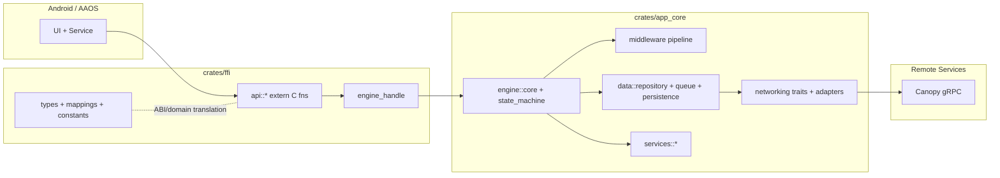
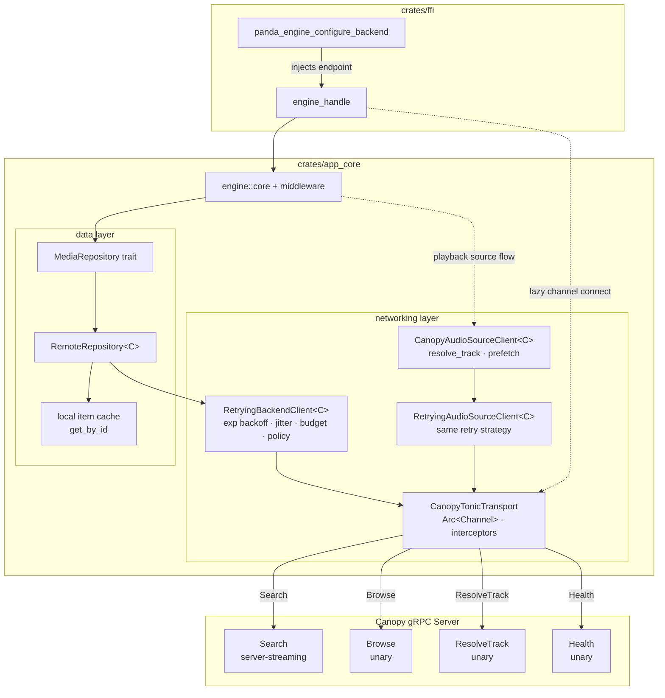
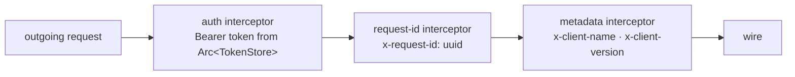
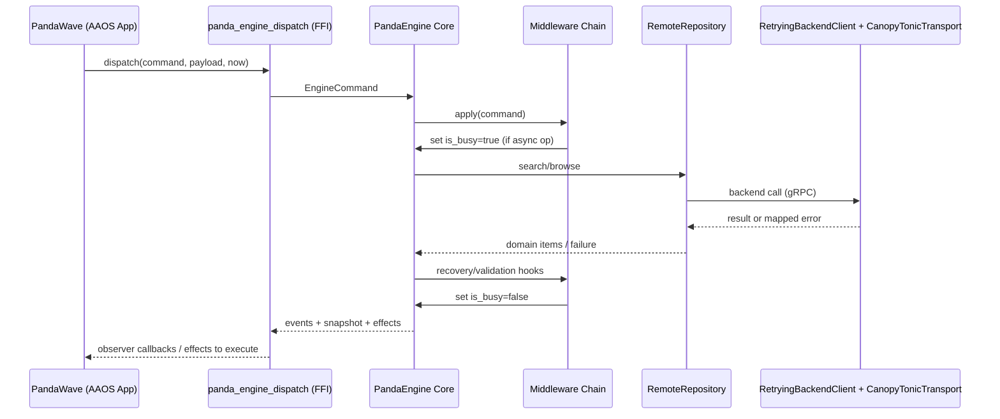
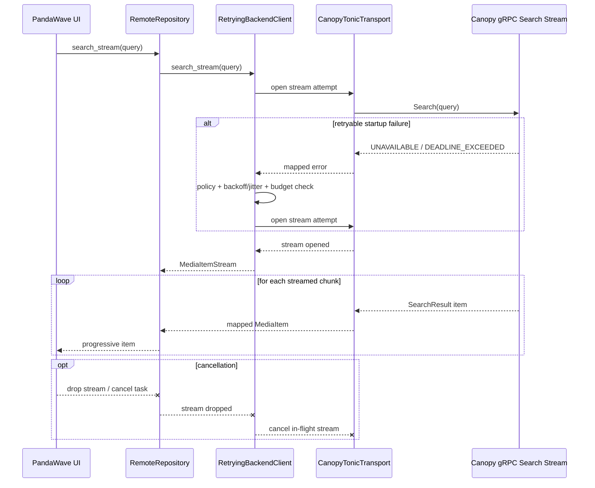

# Rust Engine

This workspace contains **PandaEngine**, the Rust source-of-truth engine for PandaWave.

Android modules communicate with the engine through the AIDL service boundary in
`:core:rust-bridge`. The Android native host will call this workspace through a
thin handwritten JNI shim over the `panda_engine_ffi` C ABI. Rust owns
deterministic domain behavior: commands, events, snapshots, middleware,
recovery, and effect emission.

## Quick Start

From `engine/`:

```powershell
# 1) Fast confidence check
cargo check -p media_app_core -p panda_engine_ffi

# 2) Run focused tests for the most touched boundaries
cargo test -p media_app_core core::core_tests -- --nocapture
cargo test -p panda_engine_ffi -- --nocapture

# 3) Run full app_core suite before larger merges
cargo test -p media_app_core -- --nocapture
```

If you are changing architecture/module boundaries, also run `cargo test --workspace`.

## Current State (Middleware / Engine)

- Async-first engine dispatch with explicit `is_busy` lifecycle for long-running work.
- Middleware chain with validation, recovery, and side effect orchestration.
- Recoverable-path behavior surfaces explicit recovery events (not silent empty outcomes).
- Voice workflow coverage includes negative/error paths and cleanup guarantees.
- FFI bridge has async slow-dispatch coverage to protect against deadlock regressions.
- Networking is transport-agnostic at core boundaries, with gRPC details isolated in networking adapters.

## Architecture At a Glance



The full Android hosting plan lives in
[`../../docs/native-engine-host.md`](../../docs/native-engine-host.md). The key
rule is that `app_core` stays Android-free, `panda_engine_ffi` owns the stable C
ABI, and the Android JNI shim owns JVM/native conversion only.

## Crates

```text
crates/app_core
  Core domain + engine logic (models, reducer/state machine, middleware, networking boundaries).

crates/ffi
  C ABI/FFI adapter used by Android bridge layers.
```

### Module Ownership (current)

- `app_core::engine::core` keeps production engine logic; test coverage is split under `app_core::engine::core::core_tests::*` by domain theme.
- `ffi::lib` is a crate root only; FFI internals are split into `api`, `types`, `engine_handle`, `constants`, and `mappings`.

### Key Paths (quick navigation)

- `crates/app_core/src/engine/core.rs` — orchestration root + public `Engine` API.
- `crates/app_core/src/engine/core/` — focused command/platform/effects/persistence/control handlers.
- `crates/app_core/src/middleware/` — trait + standard/analytics/pipeline modules.
- `crates/app_core/src/data/` — queue, repository abstractions, persistence contracts.
- `crates/app_core/src/networking/` — transport traits, canopy adapters, retry wrappers.
- `crates/ffi/src/lib.rs` — stable C ABI exports and curated re-exports.

## Local Verification

Run from `engine/`:

```powershell
cargo test --workspace
cargo clippy --workspace --tests
cargo fmt --check
cargo llvm-cov
```

### Recommended verification profiles

```powershell
# Fast (inner-loop): compile + critical boundaries
cargo check -p media_app_core -p panda_engine_ffi
cargo test -p media_app_core core::core_tests -- --nocapture
cargo test -p panda_engine_ffi -- --nocapture

# Refactor-safe (when touching data/networking/middleware)
cargo test -p media_app_core -- --nocapture
cargo test -p panda_engine_ffi -- --nocapture

# Full gate (pre-merge / release hardening)
cargo test --workspace -- --nocapture
cargo clippy --workspace --tests
cargo fmt --check
```

### Targeted verification during refactors

```powershell
# Core only
cargo test -p media_app_core core::core_tests -- --nocapture

# Networking retry wrappers
cargo test -p media_app_core retrying_backend_client -- --nocapture
cargo test -p media_app_core retrying_audio_source_client -- --nocapture

# FFI boundary
cargo test -p panda_engine_ffi -- --nocapture
cargo check -p media_app_core -p panda_engine_ffi
```

## Architecture Highlights

- **Deterministic Core**: Reducer/state machine drives predictable command→event→snapshot transitions.
- **Middleware Pipeline**: Validation + recovery + telemetry-friendly extension points.
- **Async Repository Contracts**: Async repository operations and busy-state transitions are explicitly tested.
- **Transport Isolation**: Core depends on traits (`BackendClient`, `AudioSourceClient`) rather than transport SDKs.
- **Canopy gRPC Path**: `canopy.proto` + `tonic-build` generated types, channel reuse, interceptor metadata, health mapping.
- **Progressive Search**: Additive streaming search path for progressive UI consumption.
- **Retry Hardening**: Backend/audio-source retry wrappers support policy gating, exponential backoff, jitter, and retry time budgets.
- **Cancellation Safety**: Explicit cancellation coverage for long-running async networking paths.

## Networking Composition (Current)

```text
CanopyTonicTransport
  -> RetryingBackendClient<C>
  -> RemoteRepository<C>
  -> Engine middleware/dispatch

CanopyAudioSourceClient<C>
  -> RetryingAudioSourceClient<C>
  -> Engine playback/source flow
```

## Networking Composition (Full gRPC Stack)



### Interceptor chain (per request)



## Sequence Diagram: Engine Command Dispatch



## Sequence Diagram: Progressive Search Stream



## FFI Integration Guide (Android)

1. **Package Native Library**: build `libpanda_engine_ffi.so` for supported
   Android ABIs.
2. **Load Library**: Android calls `System.loadLibrary("panda_engine_ffi")`.
3. **JNI Shim**: Kotlin calls JNI methods that delegate to the C ABI functions
   below.
4. **Initialize Logging**: `panda_engine_init_logging(level)`.
5. **Create Engine**: `panda_engine_create(now_millis)`.
6. **Enable Vosk (Optional)**: `panda_engine_enable_vosk(engine, model_path)`.
7. **Set Observer**: `panda_engine_set_observer(...)` for state/event callbacks.
8. **Dispatch Commands**: `panda_engine_dispatch(engine, type, payload, now_millis)`.
9. **Dispatch Platform Events**:
   `panda_engine_dispatch_platform_event(engine, type, payload, now_millis)`.
10. **Process Audio**: stream PCM 16-bit 16kHz mono through
    `panda_engine_process_audio_raw`.
11. **Handle Effects**: query `panda_engine_get_effects_count/types` and execute
    platform effects.
12. **Persist/Restore**: use `panda_engine_save` and `panda_engine_restore` on
    lifecycle transitions.

## Troubleshooting

- **`cargo test --workspace` reports 0 tests**:
  - Confirm you are in `rust/engine` and running against the intended workspace root.
  - Run targeted crates explicitly (`-p media_app_core`, `-p panda_engine_ffi`) to verify expected suites.
- **FFI tests pass but Android integration fails**:
  - Re-check observer lifecycle (`create` -> `set_observer` -> `dispatch` -> `destroy`).
  - Verify payload/event constants used on Android still match `ffi::constants`.
- **Intermittent networking failures in tests**:
  - Prefer retry-wrapper targeted tests first to isolate transport vs policy behavior.
  - Re-run with `-- --nocapture` and inspect mapped error transitions in test output.

## Contribution Notes (modularization guardrails)

- Prefer thin module roots (`mod.rs` or top-level file) plus focused submodules by responsibility.
- Keep crate boundaries clean: `app_core` should not depend on Android/platform details; `ffi` should not own domain rules.
- Keep public surface intentional: default to `pub(crate)`/`pub(super)` unless a symbol is required cross-module/crate.
- For large files, split by behavior domain first (dispatch/effects/persistence/tests), not by arbitrary line count.
- After each structural change, run at least targeted tests for touched areas plus `cargo check` for both core and FFI crates.
